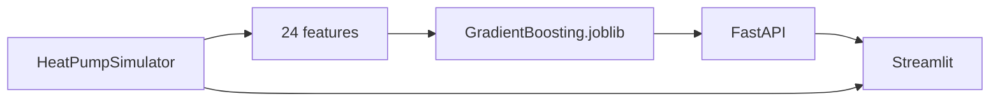

# Heat Pump Fault Detection & Diagnostics

Closed-loop FDD for a vapour-compression heat pump: CoolProp R410A cycle → 24 features (including residuals vs a healthy cycle) → calibrated Gradient Boosting → FastAPI + Streamlit.

Built as a **portfolio product**, not a lab notebook: a recruiter can clone, run, and watch the model switch from `Normal` to `Condenser_Fouling` when condenser fouling is injected.


## 60-second demo

1. `pip install -r requirements.txt && streamlit run dashboard.py`
2. Open **Live FDD**, inject `Condenser_Fouling`.
3. `P_cond` rises, COP drops, the label switches after the red injection line.

Optional API (the dashboard uses it when it is up, otherwise a local engine):

```bash
uvicorn api.app:app --reload    # http://localhost:8000/docs
```

Docker:

```bash
docker compose up --build
```

The compose stack wires Streamlit to `http://api:8000`.

## Why it exists

Fouling, fan faults and refrigerant leaks all hurt COP, but the signatures overlap. Threshold rules misfire. This project:

- Simulates physically consistent R410A cycles (CoolProp).
- Decouples condenser **fouling** (pinch / subcooling) from **fan** faults (airflow, compressor work, discharge temperature).
- Serves a calibrated classifier so Diagnosis / Live FDD show readable probabilities.

**For PM interviews:** the unit of value is a decision — fault class + confidence — not a notebook metric.  
**For ML interviews:** the interesting part is the physics features and class overlap, not stacking more estimators. Scores below are on **synthetic** data.

## Architecture



| Path | Role |
|---|---|
| `src/simulator.py` | Cycle model, CoolProp R410A, fault physics |
| `src/data_generator.py` | 5000 labelled operating points |
| `src/ml_models.py` | Random Forest + tuned / calibrated Gradient Boosting |
| `src/inference.py` | Shared predict / simulate / live_trace |
| `src/service.py` | Dashboard client: API first, local fallback |
| `api/app.py` | `GET /health`, `POST /predict`, `POST /simulate`, `POST /live` |
| `dashboard.py` | Exploration, diagnosis, live FDD, P-h diagrams |
| `models/` | Serialized classifier + metadata |

## Faults

| Class | Physical signature |
|---|---|
| Normal | Nominal A7/W40-like operation |
| Condenser_Fouling | Pinch up, subcooling down, modest discharge rise |
| Evaporator_Fouling | P_evap down, superheat up |
| Refrigerant_Undercharge | P_evap down, superheat up, capacity down |
| Condenser_Fan_Fault | Airflow down, P_cond and T_discharge rise, COP down |
| Evaporator_Fan_Fault | Airflow down, mass flow and capacity down |

## Results

Hold-out on 5000 CoolProp cycles (24 features, 30% test, Gradient Boosting + GridSearch + probability calibration):

| Model | Accuracy | F1 macro |
|---|---|---|
| Gradient Boosting (calibrated) | 99.8% | 0.997 |
| Random Forest | 99.7% | 0.995 |

Per-class F1: `Normal` 1.00, `Condenser_Fouling` 1.00, `Condenser_Fan_Fault` 1.00, `Refrigerant_Undercharge` 0.99, `Evaporator_Fouling` 0.99.

These numbers measure **how cleanly the simulator separates faults**, not field-labelled HVAC data. The demo still has to show that fouling is not predicted as a fan fault.

## Tests

```bash
pytest -q
```

CI runs the same suite on every push. CoolProp saturation pressure at 0 °C must stay within 0.5% of 8.0 bar.

## License

MIT
