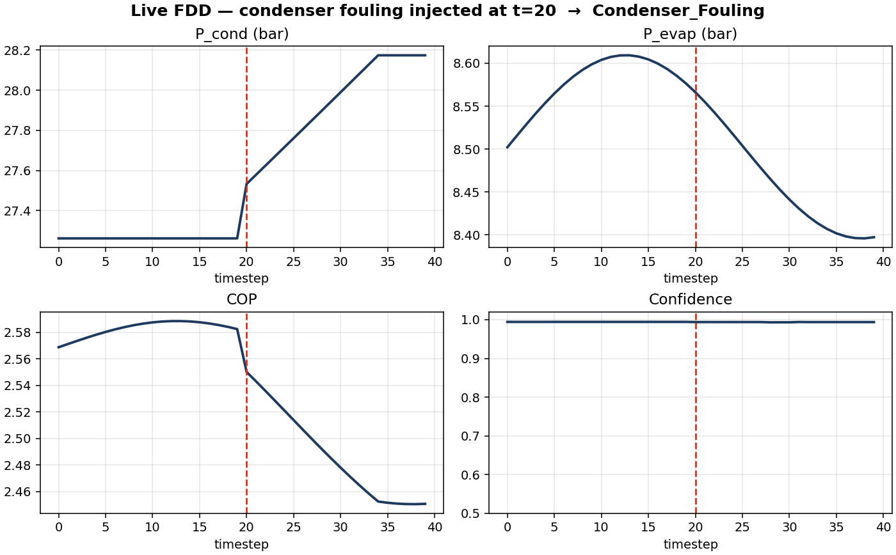
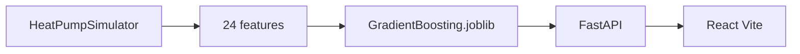

# Heat Pump Fault Detection & Diagnostics

Closed-loop FDD for a vapour-compression heat pump: CoolProp R410A cycle → 24 features (including residuals vs a healthy cycle) → calibrated Gradient Boosting → FastAPI + React dashboard.

Built as a **portfolio product**, not a lab notebook: a recruiter can clone, run, and watch the model switch from `Normal` to `Condenser_Fouling` when condenser fouling is injected.



## 60-second demo

```bash
pip install -r requirements.txt
uvicorn api.app:app --reload          # http://localhost:8000/docs
cd web && npm install && npm run dev  # http://localhost:5173
```

The glass dashboard loads COP, class mix, a fouling injection trace, and scenario status from `GET /api/stats`, `/api/overview`, `/api/activity`, and `/api/challenges`.

Streamlit (`dashboard.py`) is still in the repo for P-h diagrams and manual inject controls:

```bash
streamlit run dashboard.py            # http://localhost:8501
```

Docker (API + React; Streamlit is not in the compose path):

```bash
docker compose up --build
```

Then open `http://localhost:5173`. The browser talks to `http://localhost:8000`.

## Why it exists

Fouling, fan faults and refrigerant leaks all hurt COP, but the signatures overlap. Threshold rules misfire. This project:

- Simulates physically consistent R410A cycles (CoolProp).
- Decouples condenser **fouling** (pinch / subcooling) from **fan** faults (airflow, compressor work, discharge temperature).
- Serves a calibrated classifier so Diagnosis / Live FDD show readable probabilities.

**For PM interviews:** the unit of value is a decision — fault class + confidence — not a notebook metric.  
**For ML interviews:** the interesting part is the physics features and class overlap, not stacking more estimators. Scores below are on **synthetic** data.

## Architecture



| Path | Role |
|---|---|
| `src/physics/simulator.py` | Cycle model, CoolProp R410A, fault physics |
| `src/studies/synthetic/generator.py` | 5000 labelled operating points |
| `src/fdd/ml_models.py` | Random Forest + tuned / calibrated Gradient Boosting |
| `src/fdd/inference.py` | Load the model and diagnose a feature vector |
| `src/service.py` | Streamlit client: API first, local fallback |
| `api/app.py` | `GET /health`, `POST /predict`, `POST /simulate`, `POST /live`, `GET /api/*` |
| `web/` | Glassmorphism dashboard (primary UI) |
| `dashboard.py` | Leftover Streamlit: exploration, live inject, P-h diagrams |
| `models/synthetic/` | Serialized classifier + metadata |

## Faults

| Class | Physical signature |
|---|---|
| Normal | Nominal A7/W40-like operation |
| Condenser_Fouling | Pinch up, subcooling up, modest discharge rise |
| Evaporator_Fouling | P_evap down, superheat up |
| Refrigerant_Undercharge | P_evap down, superheat up, capacity down |
| Condenser_Fan_Fault | Airflow down, P_cond and T_discharge rise, COP down |
| Evaporator_Fan_Fault | Airflow down, superheat and T_discharge down, capacity down |

## Results

Hold-out on 5000 CoolProp cycles (24 features, 30% test, Gradient Boosting + GridSearch + probability calibration):

| Model | Accuracy | F1 macro |
|---|---|---|
| Gradient Boosting (calibrated) | 99.6% | 0.994 |
| Random Forest | 99.6% | 0.994 |

Per-class F1: `Normal` 1.00, `Condenser_Fouling` 1.00, `Condenser_Fan_Fault` 1.00, `Refrigerant_Undercharge` 0.98, `Evaporator_Fouling` 0.99, `Evaporator_Fan_Fault` 0.99.

These numbers measure **how cleanly the simulator separates faults**, not field-labelled HVAC data. The demo still has to show that fouling is not predicted as a fan fault.

### Confronted with measured data

The residual design was checked against the NIST *FDD Heat Pump Cooling* campaign — 7375 chamber tests on two machines with imposed faults. Full method and figures in [docs/NIST_FINDINGS.md](docs/NIST_FINDINGS.md).

| Feature set | Random CV | Leave-one-machine-out |
|---|---|---|
| Raw measurements | 0.954 | 0.333 |
| Residuals only | 0.937 | **0.602** |

Every residual row above uses a healthy reference calibrated on the **target** machine. Rebuilt from the training machine only — a genuinely unknown unit — residuals-only drops to **0.318** (F1 macro 0.290), against 0.251 for the majority class. A second-order polynomial with indoor dew point, the form NIST itself uses, reaches 0.302; a random forest 0.265. No reference model tried lifts that ceiling.

Two things follow. **Residuals nearly double detection when the healthy reference is calibrated on the target machine** (0.333 → 0.602). And **a random split scores 0.95 where an honest one scores 0.60** — so any accuracy figure here, including the 99.6% above, has to name its validation protocol.

### What calibration costs

If residual FDD needs healthy data from the machine in service, the practical question is how much. Measured by leave-one-machine-out over 20 draws, with the calibrating tests held out of the test set:

| Healthy tests from the target machine | Accuracy | F1 macro |
|---|---|---|
| 0 — transferred reference | 0.318 | 0.290 |
| 10 | 0.377 | 0.324 |
| 50 | 0.456 | 0.380 |
| all (~625–727) | 0.602 | 0.479 |

**Fifty healthy tests recover only about 49% of the gap.** Reaching 90% takes essentially the full set. Spreading the sampled tests across the operating range rather than drawing at random helps most when few are available (n = 5: 0.391 against 0.314).

The field reading: a handful of commissioning measurements is not a calibration. Covering the operating envelope is what matters, and that is a deployment constraint rather than an algorithmic one.

## Tests

```bash
pytest -q
```

CI runs the same suite on every push. CoolProp saturation pressure at 0 °C must stay within 0.5% of 8.0 bar.

## License

MIT
