# 0. Le problème et la contrainte fondatrice

Une pompe à chaleur tombe rarement en panne d'un coup. Elle se dégrade. Le condenseur
s'encrasse, une fuite lente vide une partie du fluide, un ventilateur faiblit. La machine
continue de chauffer, et consomme de plus en plus pour le même service. Le **COP** — la chaleur
fournie divisée par l'électricité consommée — glisse de 4,0 à 3,2 en quelques mois. Personne ne
le voit ; la facture monte de 25 %.

Le technicien n'a pas besoin d'apprendre qu'il y a un problème. Il a besoin de savoir
**lequel**. Et c'est difficile parce que des pannes très différentes se ressemblent : un
condenseur encrassé et un ventilateur de condenseur défaillant font tous deux monter la
pression haute et chuter le COP. L'un se règle avec un nettoyage, l'autre avec une pièce.

## La contrainte qui commande tout le reste

Pour apprendre à nommer une panne, il faut des exemples étiquetés. Or ces données sont **rares
et chères** : il faut délibérément encrasser un condenseur, retirer de la charge, brider un
ventilateur, et instrumenter la machine pendant qu'on l'abîme. Peu de laboratoires le font.

Ce projet répond par la simulation. Ce n'est pas un contournement, c'est **la réponse standard
du domaine** — le NIST et l'ASHRAE procèdent de même, et la rareté des données de défaut est
précisément ce qui motive leurs campagnes d'essais.

Mais ce choix crée une tension qu'il faut annoncer d'emblée : **si le même modèle fabrique les
questions et les réponses, que mesure-t-on exactement ?** La seconde moitié de ce document ne
traite que de cela.

## Comment lire ce document

Le système est parcouru module par module, dans l'ordre où circule une mesure. À chaque étape,
trois questions :

| | |
|---|---|
| **Physique** | Quel phénomène est modélisé, avec quelle équation |
| **Apprentissage** | Quelle décision de modélisation cela impose |
| **Ingénierie** | Pourquoi ce code vit ici et pas ailleurs |

## Structure du dépôt

```
heat-pump-fdd/
|
+-- src/
|   +-- physics/                 le modèle physique — n'importe rien du projet
|   |   +-- simulator.py           cycle R-410A, injection des défauts
|   |   +-- thermo_lab.py          balayages COP, enveloppes
|   |   +-- thermodynamic_viz.py   diagrammes pression-enthalpie
|   |
|   +-- fdd/                     la méthode — partagée par toutes les études
|   |   +-- features.py            contrat des 24 grandeurs, résidus
|   |   +-- ml_models.py           entraînement, sélection de modèle
|   |   +-- inference.py           FDDEngine : charger, diagnostiquer
|   |   +-- visualization.py       figures d'entraînement
|   |
|   +-- studies/                 les jeux de données
|       +-- synthetic/
|           +-- generator.py       tirage, injection, assemblage
|           +-- taxonomy.py        les classes de panne de cette étude
|           +-- scenarios.py       la démo : simulate_cycle, live_trace
|           +-- paths.py           source unique des chemins d'artefacts
|
+-- api/            FastAPI — 4 routes d'inférence, 17 de tableau de bord
+-- web/            React — lit la liste des grandeurs depuis l'API
+-- tests/          43 tests, dont 5 gardes d'architecture
+-- EDA/            notebooks de confrontation aux essais mesurés
+-- docs/           documentation technique et ce dossier
|
+-- outputs/synthetic/   jeu de données et figures, par étude
+-- models/synthetic/    modèle sérialisé et ses métadonnées
```

La règle d'import est à sens unique et vérifiée par des tests :

$$\texttt{studies/} \;\longrightarrow\; \texttt{fdd/} \;\longrightarrow\; \texttt{physics/}$$

# 1. La physique — `src/physics/`

## `simulator.py` — la source de vérité

Ce module calcule un cycle à compression de vapeur au R-410A. Il est la racine de la
dépendance : tout s'appuie sur lui, il ne s'appuie sur rien. Les propriétés du fluide viennent
de CoolProp, avec des corrélations de repli.

Trois entrées définissent un point de fonctionnement :

| Entrée | Plage | Sens |
|---|---|---|
| $T_{source}$ | −10 à 20 °C | Air extérieur, côté froid |
| $T_{sink}$ | 30 à 55 °C | Eau de chauffage, côté chaud |
| $n$ | 0,3 à 1,0 | Régime du compresseur |

Le point nominal est **A7/W40** : air à 7 °C, eau à 40 °C.

### Le modèle d'échangeur, et l'exposant qui fait tout

$$UA_{evap} = UA_{evap}^{nom}\,\bigl(1 - 0{,}50\,\varphi_{evap}\bigr)\; r_{evap}^{\,1{,}45}$$

$$UA_{cond} = UA_{cond}^{nom}\,\bigl(1 - 0{,}50\,\varphi_{cond}\bigr)\; r_{cond}^{\,1{,}45}$$

avec $UA_{evap}^{nom} = 500$ W/K et $UA_{cond}^{nom} = 600$ W/K ; $\varphi$ l'encrassement
(0 = propre) et $r$ le débit d'air rapporté au nominal.

**Physique.** $UA$ est le coefficient global d'échange : combien de chaleur passe par degré
d'écart. L'encrassement dépose une couche isolante et le dégrade **linéairement**. Une perte de
débit d'air le dégrade avec un **exposant 1,45**, parce que la convection côté air s'effondre
plus vite que proportionnellement au débit.

**Apprentissage. C'est le cœur du projet.** Les deux pannes dégradent la même grandeur, mais
par deux lois différentes. C'est *cette* différence qui rend les classes séparables. Sans elle,
il n'y a pas de problème de classification — seulement deux noms pour un même symptôme.

L'écart de température aux bornes de l'échangeur, le *pincement*, en découle :

$$\Delta_{evap} = 5 + 7\left(1 - \frac{UA_{evap}}{UA_{evap}^{nom}}\right)$$

$$\Delta_{cond} = 5 + 7\left(1 - \frac{UA_{cond}}{UA_{cond}^{nom}}\right) + 8\,(1 - r_{cond})$$

puis les températures de changement d'état :

$$T_{evap} = T_{source} - \Delta_{evap} \qquad T_{cond} = T_{sink} + \Delta_{cond}$$

**À retenir : le condenseur est du côté du puits chaud.** Cette convention deviendra un piège
au moment de confronter le modèle à des essais mesurés en mode refroidissement, où c'est
l'unité extérieure qui joue ce rôle.

### Le compresseur

Le rendement isentropique suit une corrélation de compresseur scroll, maximale autour d'un taux
de compression $\tau = 3$ :

$$\eta_{is} = 0{,}75 \cdot f(\tau) \cdot g(n), \qquad
f(\tau) = \mathrm{borne}\bigl(1 - 0{,}05\,(\tau-3)^2,\; 0{,}4,\; 1\bigr), \qquad
g(n) = 1 - 0{,}30\,(n - 0{,}7)^2$$

$$\eta_{vol} = 1 - 0{,}05\left(\tau^{1/k} - 1\right), \qquad \tau = \frac{P_{cond}}{P_{evap}}$$

**Lecture utile** : un défaut qui écarte $\tau$ de son optimum dégrade le COP **deux fois** —
par la thermodynamique, et par la chute du rendement du compresseur.

La température de refoulement suit une loi polytropique corrigée par ce rendement :

$$T_{ref}^{\,ideal} = \bigl(T_{asp} + 273{,}15\bigr)\,\tau^{\frac{k-1}{k}} - 273{,}15
\qquad
T_{ref} = T_{asp} + \frac{T_{ref}^{\,ideal} - T_{asp}}{\eta_{is}}$$

Un compresseur moins efficace transforme davantage de travail en chaleur : il refoule plus
chaud. C'est pourquoi la température de refoulement est un indicateur de santé si sensible.

### Puissances et COP

$$Q_{cond} = \dot m\,(h_2 - h_3) \qquad
W_{comp} = 1{,}10 \cdot \dot m\,\Delta h_{reel} \qquad
COP = \frac{Q_{cond}}{W_{comp}}$$

Le facteur 1,10 couvre les pertes mécaniques et électriques. Le détail des enthalpies est en
annexe B.

### Le défaut n'est pas du bruit

Un défaut est un **paramètre physique dégradé en amont** — $\varphi_{cond}$, $r_{cond}$, la
charge $c$ — et toutes les grandeurs en découlent de façon cohérente. Une ligne change dans
l'appel, le cycle entier est recalculé.

**Ingénierie.** C'est ce qui permet d'explorer un défaut de façon continue, à n'importe quelle
sévérité et dans n'importe quelles conditions — ce qu'aucun jeu d'essais réels ne permet.

### Ce que la confrontation aux mesures a révélé

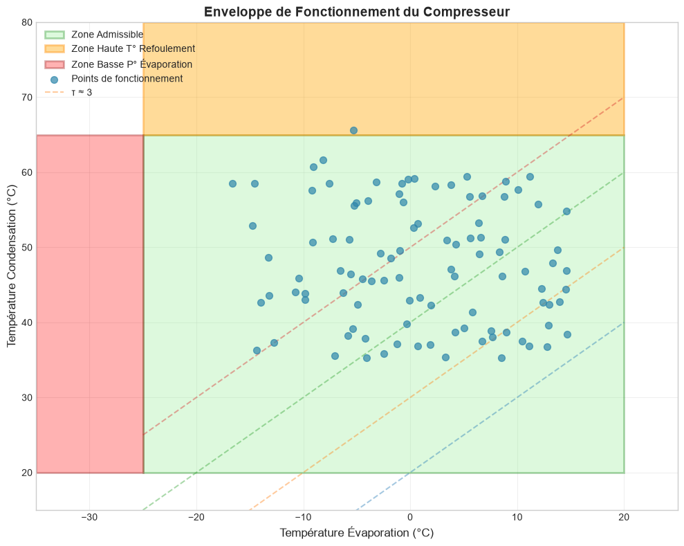

Quatre défauts de modélisation, trouvés en comparant les signatures simulées à des essais
mesurés, puis corrigés :

| Défaut trouvé | Conséquence |
|---|---|
| Surcharge sans branche de calcul | Une classe déclarée qui ne produisait aucun effet |
| Sous-refroidissement inversé sur l'encrassement condenseur | Une grandeur du vecteur variait à l'envers |
| Surchauffe et refoulement inversés sur le ventilateur d'évaporateur | Deux grandeurs à l'envers |
| Plafond de refoulement déclaré mais jamais appliqué | Des cycles à 319 °C dans les données d'apprentissage |

Le dernier est le plus instructif : $T_{ref}^{max} = 130$ °C figurait dans le code, mais
n'était utilisé que pour afficher une alerte — jamais pour borner la valeur. Une partie des
exemples décrivait des machines qui ne peuvent pas exister.

## `thermodynamic_viz.py` et `thermo_lab.py` — des vues, pas de la physique

Diagrammes pression-enthalpie et balayages de COP. Ils vivent dans `physics/` parce qu'ils
manipulent les mêmes propriétés du fluide, mais sont importés par l'API et **jamais par le
pipeline d'apprentissage**. Une visualisation n'entre pas dans un vecteur de features.

# 2. Du cycle au vecteur — `src/fdd/features.py`

## Le problème de représentation

Un résultat de cycle n'est pas un vecteur exploitable. Il faut décider **quoi** montrer au
modèle — et ce choix pèse plus lourd que celui de l'algorithme.

Le contrat compte 24 colonnes : 3 conditions, 16 grandeurs mesurées ou dérivées, 5 **résidus**.

## Les résidus, ou l'analogie de la fièvre

Dire « 37,8 °C » ne veut rien dire tant qu'on ignore de qui l'on parle. Dire « 0,9 °C au-dessus
de sa température habituelle » est un signal, quel que soit l'individu.

$$\tilde{x} = x_{observe} - \hat{x}_{sain}\bigl(T_{source},\, T_{sink},\, n\bigr)$$

Une surchauffe de 12 K ne dit rien : elle dépend de la machine, de la saison, de la charge. Une
surchauffe **1,7 K au-dessus de ce que cette machine-ci ferait en bonne santé, maintenant** est
une signature de sous-charge.

**Apprentissage.** C'est la méthode des résidus de Li et Braun : un modèle de référence prédit
le comportement sain, le classifieur travaille sur l'écart. Le docstring du module la nomme.

## La couture qui rend toute la validation possible

```python
def cycle_to_features(result, ..., baseline=None, ...):
    if baseline is None:
        baseline = healthy_cycle(T_source, T_sink, speed_ratio)   # <- simule
```

**Par défaut, le cycle sain de référence est calculé par le simulateur.** Les deux termes de la
soustraction sortent de la même machine à calculer : c'est là qu'est la circularité annoncée en
ouverture.

Mais le paramètre `baseline` est exposé. Passer un cycle sain **mesuré** transforme les cinq
résidus en écarts réels, sans modifier une ligne du reste du pipeline.

**Ingénierie.** Une seule ligne de signature est ce qui a rendu possible toute la confrontation
décrite en partie 7. C'est l'exemple le plus net, dans ce projet, de ce qu'un bon point
d'extension fait gagner.

## Une redondance

$\texttt{compression\_ratio}$ et $\texttt{pressure\_ratio}$ sont **le même nombre**, vérifié à
la précision machine sur tous les points testés. Le modèle dispose de 23 entrées indépendantes,
pas 24.

# 3. Fabriquer un jeu de données — `src/studies/synthetic/`

## Pourquoi une couche « études » séparée

Un jeu de données n'est pas un fichier. C'est un triplet : **des données, une taxonomie de
pannes, un emplacement d'artefacts**. Le jour où une seconde source arrive, rien de la méthode
ne doit bouger. C'est la justification du découpage architectural, et elle est vérifiable.

| Module | Rôle |
|---|---|
| `generator.py` | Tirage des conditions, injection des défauts, assemblage |
| `taxonomy.py` | Les classes de panne et leurs paramètres — propre à l'étude |
| `scenarios.py` | La démo : `simulate_cycle`, `live_trace` — pas la méthode |
| `paths.py` | Source unique des chemins, aucun chemin en dur ailleurs |

Les conditions sont tirées uniformément dans le domaine, un défaut est choisi puis injecté à
une sévérité tirée, et le cycle est recalculé.

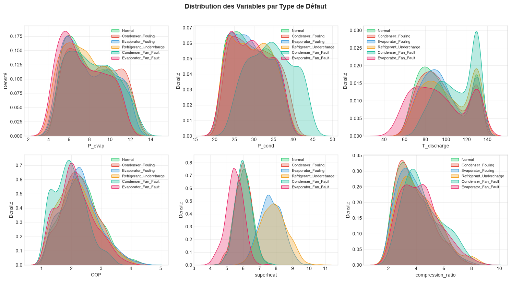

Six classes sont produites : sain, encrassement de condenseur, encrassement d'évaporateur,
sous-charge, ventilateur de condenseur, ventilateur d'évaporateur. Deux autres — surcharge et
fuite de clapet — sont **déclarées avec une branche d'injection mais jamais générées**. Ce sont
des classes fantômes, et leur sort est une décision documentée plutôt que laissée en l'état.

## Le bruit de mesure, et une incohérence qui compte

Un bruit gaussien est ajouté aux grandeurs qu'un capteur mesure : 0,5 °C sur les températures,
2 % sur les pressions, 3 % sur les puissances. Il ne modélise ni dérive de capteur, ni biais,
ni régime transitoire.

**Mais il est appliqué après le calcul des grandeurs dérivées, et celles-ci ne sont pas
recalculées.** Mesuré sur les 5000 exemples : **aucune ligne** ne vérifie
$\texttt{pressure\_ratio} = P_{cond}/P_{evap}$, ni $COP = Q_{cond}/W_{comp}$.

La portée de ce défaut apparaît en regardant ce dont le modèle se sert réellement — voir la
partie suivante.

# 4. Le modèle — `src/fdd/ml_models.py` et `inference.py`

## Le choix d'algorithme, et pourquoi il compte peu

Gradient Boosting calibré en probabilité, sélectionné par recherche sur grille et validation
croisée stratifiée.

| Modèle | Accuracy | F1 macro |
|---|---|---|
| Gradient Boosting calibré | 99,6 % | 0,994 |
| Forêt aléatoire | 99,6 % | 0,994 |

**Pourquoi pas douze algorithmes.** Sur des données simulées où les classes sont déjà nettement
séparées, un modèle de plus n'apporte rien de mesurable — les deux candidats sont à égalité.
Empiler des algorithmes aurait donné une **illusion de rigueur**. Le travail utile était dans
la validation.

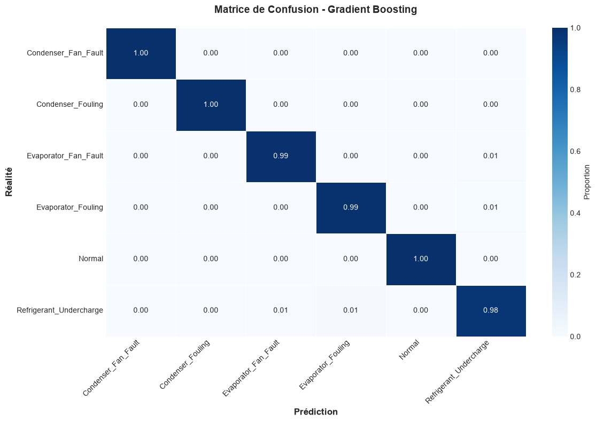

La matrice de confusion montre une séparation quasi parfaite. C'est précisément ce résultat que
la suite du document met en doute — non pas parce qu'il serait faux, mais parce qu'il mesure
autre chose que ce qu'on croit.

## Ce dont le modèle se sert réellement

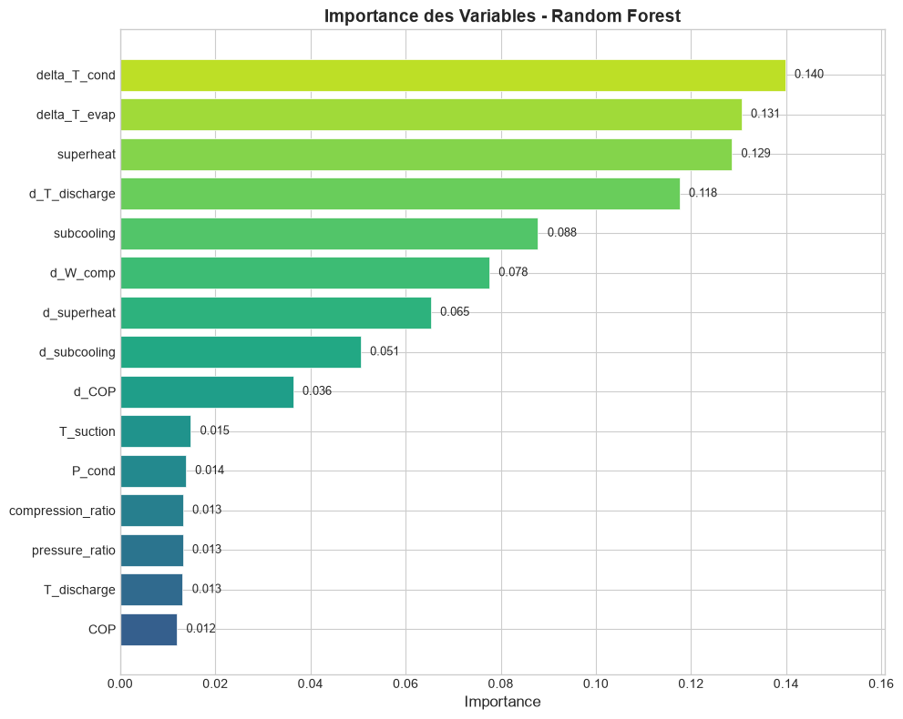

Cette figure est la plus instructive du jeu simulé, pour deux raisons.

**D'abord, 18 des 24 grandeurs ont une importance quasi nulle.** Le modèle en utilise six. Le
contrat de features est donc largement surdimensionné, ce qui prépare une simplification.

**Ensuite, et c'est plus gênant : les trois grandeurs les plus importantes ne portent aucun
bruit de mesure.**

| Rang | Grandeur | Importance | Bruitée ? |
|---|---|---|---|
| 1 | `d_COP` | 0,300 | non — le COP n'est jamais bruité |
| 2 | `delta_T_cond` | 0,293 | non — dérivée calculée avant bruitage |
| 3 | `delta_T_evap` | 0,171 | non — idem |
| 4 | `d_superheat` | 0,092 | oui |
| 5 | `superheat` | 0,076 | oui |
| 6 | `d_T_discharge` | 0,064 | oui |

**76,4 % de l'importance du modèle repose sur des grandeurs exemptes de bruit**, alors que
leurs composantes, elles, sont bruitées. Le modèle dispose donc simultanément d'une version
propre et d'une version bruitée des mêmes quantités.

Une part du 99,6 % provient ainsi d'une information qui n'existerait pas sur une machine
réelle. Ce défaut est identifié, chiffré, et sa correction est planifiée — au même titre que
les quatre défauts de physique de la partie 1.

## `FDDEngine` — charger et diagnostiquer, rien d'autre

Le moteur charge un modèle et attribue une classe à un vecteur. Il ne sait pas simuler un
défaut : cela appartient à l'étude.

Cette séparation n'a pas toujours existé. Le moteur contenait initialement le générateur de
défauts, ce qui faisait dépendre la couche partagée d'une étude particulière et interdisait
d'en ajouter une seconde. Le découplage a été fait **avant** tout déplacement de fichier, et
cinq tests l'empêchent de revenir.

## Le modèle versionné et le pin porteur

Le modèle entraîné est **sérialisé et versionné dans le dépôt**, pour que le projet se clone et
tourne sans réentraînement. Ce format dépend de la version exacte de la bibliothèque, épinglée
à `scikit-learn==1.6.1`. Une autre version rend le modèle illisible, avec une erreur qui ne
ressemble pas à un problème de version :

```
ModuleNotFoundError: No module named '_loss'
```

L'image Docker est protégée puisqu'elle installe depuis le fichier de dépendances ; un
environnement local qui a dérivé ne l'est pas.

# 5. Servir — `api/` et `web/`

| Famille | Nombre | Rôle |
|---|---|---|
| Inférence | 4 | `/health`, `/predict`, `/simulate`, `/live` |
| Tableau de bord | 17 | `/api/*` — alimenter les vues |

Vingt-et-une routes dans un module de 582 lignes, pour deux responsabilités : la couture d'un
découpage à venir est nette.


**Le contrat d'entrée est strict.** `/predict` énumère les 24 grandeurs et refuse tout champ
inconnu — une grandeur mal nommée est rejetée plutôt qu'ignorée. Cela fait de toute évolution
du contrat une **rupture de compatibilité**.

**Le front est générique** : il lit la liste des grandeurs depuis l'API. Il suivra une
évolution sans modification.

# 6. La règle qui tient l'ensemble

$$\texttt{studies/} \;\longrightarrow\; \texttt{fdd/} \;\longrightarrow\; \texttt{physics/}$$

`physics/` n'importe rien du projet ; `fdd/` peut importer `physics/` ; seule `studies/` peut
importer les deux.

**Ce que la règle interdit** : que la méthode dépende d'un jeu de données particulier.

**Ce qui la maintient** : cinq tests qui échouent si le couplage revient — le moteur ne doit
pas exposer d'interface de simulation, le module de features ne doit pas contenir de taxonomie
d'étude, l'entraîneur ne doit pas importer de générateur.

## Le récit du refactor

L'ordre a compté plus que le contenu :

1. **Découpler d'abord**, sans déplacer un fichier.
2. **Déplacer ensuite**, sans changer une ligne de logique.
3. **Ranger les artefacts par étude** en dernier.

Inverser les deux premières étapes aurait noyé une décision d'architecture dans une dizaine de
renommages.

**L'équivalence de comportement a été vérifiée à chaque étape** en comparant les sorties avant
et après — six types de défaut, leurs 24 grandeurs, la classe prédite, la confiance, une trace
temporelle. Identiques octet pour octet.

> **Pour le jury.** Un refactor ne se juge pas sur l'élégance du résultat mais sur la preuve
> que rien n'a bougé. Ici la preuve est une comparaison binaire des sorties, pas une suite de
> tests verte : les tests disent que le contrat tient, pas que les nombres sont les mêmes.

# 7. Les données mesurées

La validation s'appuie sur une campagne publique du NIST : des pompes à chaleur résidentielles
en chambre climatique, avec défauts imposés et maintenus.

| | |
|---|---|
| Essais | 7375 |
| Grandeurs | 98 colonnes, côté air et côté fluide |
| Machines | Deux, de performances différentes |
| Retenus | 5386 essais à défaut unique, 6 classes |
| Mode | Refroidissement |

Deux machines plutôt qu'une : c'est décisif, car cela permet de tester si un modèle appris sur
l'une fonctionne sur l'autre.

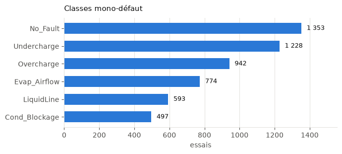

Les classes ne sont pas données : elles sont **implicites**, réparties sur cinq colonnes de
niveau où 100 % signifie nominal. Un défaut compte comme actif dès que son niveau s'écarte de
plus de 2 % — seuil qui reproduit exactement les effectifs publiés, ce qui permet de l'inscrire
en assertion dans le code.

## Trois obstacles méthodologiques

**Le mode est inversé.** Les essais sont en refroidissement, le simulateur en chauffage. En
refroidissement, c'est l'unité **extérieure** qui condense — l'inverse de la convention du
simulateur. Apparier les pannes sans vérifier ce point conduit à comparer des sens opposés et à
conclure que le modèle est faux alors que c'est l'appariement qui l'est.

**Un capteur n'est pas instrumenté sur une des deux machines.**

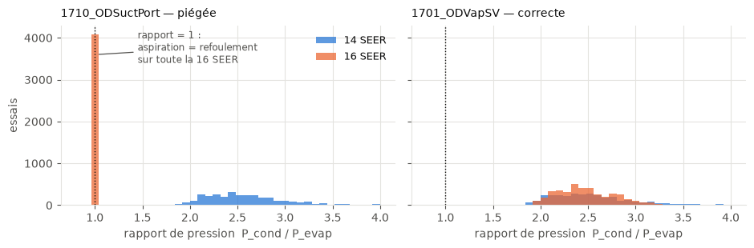

La colonne nommée « pression au port d'aspiration » contient en réalité la pression de
refoulement sur l'une des deux machines, soit 55 % des essais. Le rapport de pression y vaut
exactement 1,00 — physiquement impossible — sans qu'aucune erreur ne soit levée. Le panneau de
gauche montre le pic à 1,00 ; celui de droite, la colonne de remplacement, cohérente sur les
deux machines.

**Les domaines se recouvrent à 5,3 %.**

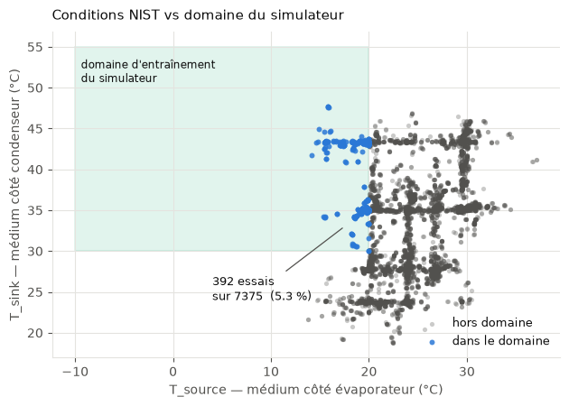

Le rectangle est le domaine sur lequel le simulateur a été entraîné ; les points sont les
essais mesurés. Ils tombent presque entièrement à l'extérieur. **Comparer des valeurs absolues
est donc exclu** ; seules les tendances sont comparables.

Enfin, les colonnes de niveau de défaut sont la réponse à trouver : les inclure parmi les
entrées reviendrait à distribuer le corrigé avec l'énoncé. Elles sont exclues, et un test le
vérifie.

# 8. Les protocoles de validation

Un score n'a aucun sens sans son protocole.

**Validation croisée aléatoire** : on mélange tous les essais, on en cache une partie. Standard,
et trompeur ici, car les essais des deux machines se retrouvent des deux côtés — le modèle peut
apprendre à reconnaître *l'installation* plutôt que *la panne*.

**Validation par machine** (*leave-one-machine-out*) : on entraîne sur une machine, on teste
sur l'autre, puis on inverse.

L'analogie est celle d'un élève. Réviser les annales puis composer sur un sujet tiré des mêmes
annales donne une bonne note. Composer sur le sujet d'un autre établissement mesure ce qu'il a
compris.

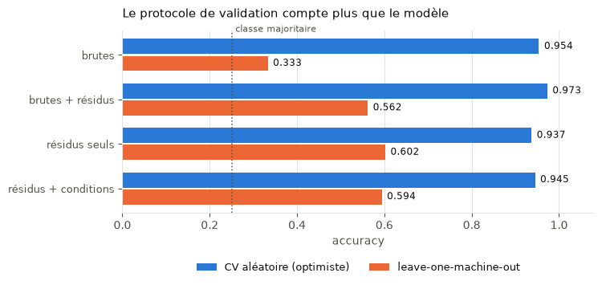

| Jeu de grandeurs | CV aléatoire | Par machine |
|---|---|---|
| Grandeurs brutes | 0,954 | 0,333 |
| Brutes et résidus | 0,973 | 0,562 |
| Résidus seuls | 0,937 | 0,602 |
| Résidus et conditions | 0,945 | 0,594 |

Classe majoritaire : 0,251.

Deux lectures. **Le jeu qui gagne en validation aléatoire n'est pas celui qui transfère le
mieux** : classer des conceptions sur un tirage aléatoire aurait fait retenir la mauvaise. Et
**ajouter les grandeurs absolues aux résidus dégrade le transfert**, parce que les valeurs
absolues permettent de ré-identifier la machine.

> **Pour le jury.** Un écart de 0,95 à 0,60 entre deux protocoles, même modèle et mêmes
> données, ne mesure pas le modèle. Il mesure le protocole.

# 9. Les résultats, et le module que chacun met en cause

## L'accord des sens de variation met en cause `simulator.py`

Le recouvrement de 5,3 % interdisant les valeurs absolues, on compare des **directions**. Pour
chaque panne et chaque grandeur, on ajuste sur les essais mesurés :

$$x = \beta_0 + \beta_1\,L + \beta_2\,T_{source} + \beta_3\,T_{sink}$$

où $L$ est le niveau de défaut. Les deux derniers termes neutralisent les conditions d'essai,
de sorte que $\beta_1$ isole l'effet de la panne. On compare $\mathrm{signe}(\beta_1)$ au signe
de la pente obtenue en balayant le même paramètre dans le simulateur.

| | Accord |
|---|---|
| Avant correction | **12 sur 16** |
| Après correction des quatre défauts | **20 sur 22** |

Le dénominateur augmente parce que la surcharge, jusque-là inerte, produit désormais des
signaux exploitables.

**Ce résultat a directement piloté une réécriture du code.** C'est l'intérêt d'une confrontation
externe : elle ne note pas le modèle, elle indique quelle ligne corriger.

## Le gain des résidus valide `features.py`

Passer des grandeurs brutes aux résidus fait monter la détection de 0,333 à 0,602, pour 1,7
point perdu en validation aléatoire. Le choix de conception du module de features est validé
**sur des mesures réelles**, et non par argument théorique.

## La dégradation des brutes met en cause `FEATURE_COLUMNS`

Mélanger absolues et résidus fait retomber le transfert de 0,602 à 0,562. Or le contrat actuel
contient précisément ce mélange. La mesure désigne une évolution à faire — que l'importance des
variables de la partie 4 confirme par un autre chemin.

## Le résultat qui réoriente le projet

Une vérification ultérieure a montré que le 0,602 reposait sur une hypothèse implicite : la
référence saine — la « température habituelle » de l'analogie — était calculée à partir
d'essais sains **de la machine testée**.

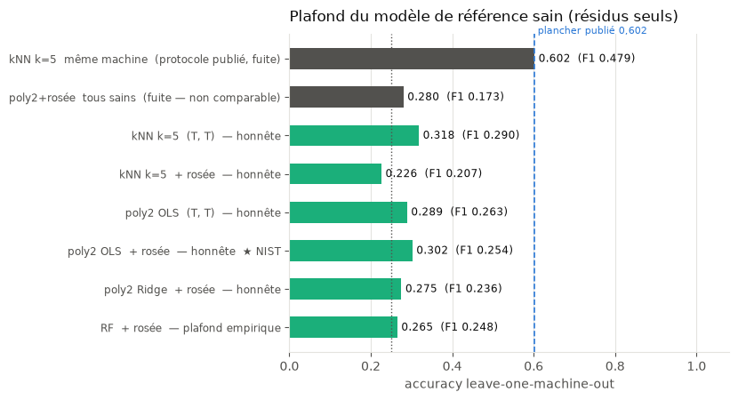

Reconstruite à partir de la seule machine d'entraînement, c'est-à-dire face à une machine
réellement inconnue, la performance s'effondre. Et **aucune forme de modèle de référence ne
lève ce plafond** : ni le polynôme d'ordre 2 avec point de rosée que le NIST décrit lui-même,
ni une régression régularisée, ni une forêt aléatoire.

| Origine de la référence saine | Accuracy | F1 macro |
|---|---|---|
| Essais sains de la machine cible | 0,602 | 0,479 |
| Référence transférée, plus proche voisin | **0,318** | 0,290 |
| Polynôme d'ordre 2 avec point de rosée | 0,302 | 0,254 |
| Forêt aléatoire avec point de rosée | 0,265 | 0,248 |

Ce n'est pas un échec : c'est une mesure.

> **Pour le jury.** L'écart entre 0,602 et 0,318 est le résultat principal de ce travail. Il ne
> dit pas que la méthode échoue, il dit ce qu'elle exige : une calibration saine sur la machine
> en service. Une méthode dont on connaît le prix est utilisable ; une méthode dont on ignore
> la condition ne l'est pas.

# 10. Le budget de calibration

Si le diagnostic exige d'avoir observé la machine en bonne santé, la question industrielle
devient : **combien de temps ?**

Protocole : validation par machine dans les deux sens ; la référence saine est construite sur
$n$ essais sains tirés de la machine testée ; ces $n$ essais sont **retirés du jeu de test**,
faute de quoi ils serviraient à la fois de calibration et d'évaluation ; vingt tirages par
valeur de $n$, moyenne et intervalle.

Les deux bornes servent de contrôle : $n = 0$ doit retomber sur 0,318 et $n = \text{tous}$ sur
0,602. Les deux ont été retrouvées exactement.

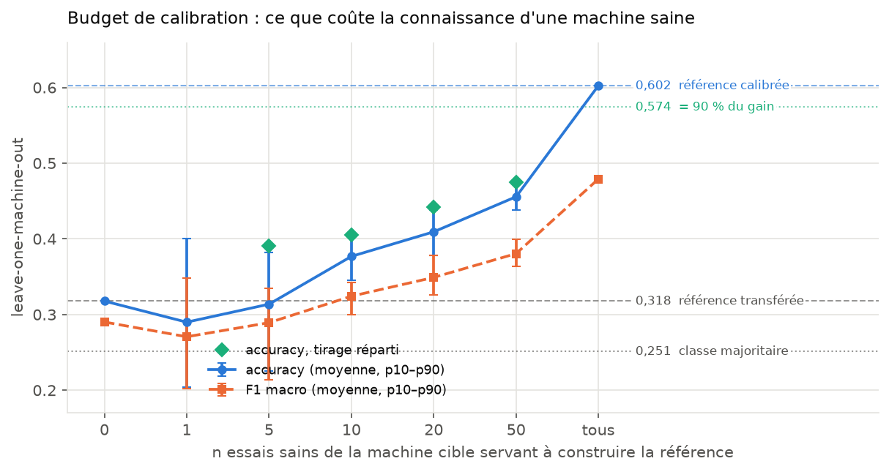

| $n$ essais sains | Accuracy | F1 macro |
|---|---|---|
| 0 — référence transférée | 0,318 | 0,290 |
| 10 | 0,377 | 0,324 |
| 50 | 0,456 | 0,380 |
| tous | 0,602 | 0,479 |

**Cinquante essais sains ne récupèrent qu'environ 49 % de l'écart.** Atteindre 90 % demande
pratiquement l'ensemble. À faible $n$, l'intervalle est très large : un tirage malheureux fait
pire que pas de calibration du tout. Répartir les essais sur le domaine de fonctionnement
plutôt que les tirer au hasard aide surtout dans cette zone — les losanges de la figure.

La lecture terrain est directe : **une poignée de mesures de mise en service ne constitue pas
une calibration.** C'est la couverture du domaine qui compte — une contrainte de déploiement,
non une limite de l'algorithme.

# 11. Quelles pannes sont réellement détectées

Une moyenne de 0,602 pour un F1 macro de 0,479 : douze points d'écart, donc des classes très
inégalement diagnostiquées. Le détail change entièrement ce que le système permet d'affirmer.

## Par classe, référence calibrée

| Panne | Précision | Rappel | F1 | n |
|---|---|---|---|---|
| **Sous-charge** | 0,748 | 0,961 | **0,832** | 1228 |
| Sans défaut | 0,722 | 0,837 | 0,741 | 1352 |
| **Surcharge** | 0,735 | 0,775 | **0,674** | 942 |
| Obstruction condenseur | 0,611 | 0,220 | 0,299 | 497 |
| Débit intérieur | 0,269 | 0,313 | 0,288 | 774 |
| **Ligne liquide** | 0,206 | 0,068 | **0,040** | 593 |

**Les défauts de charge portent tout le résultat.** La sous-charge est cohérente dans les deux
sens de transfert — 0,91 et 0,76 — donc ce n'est pas l'artefact d'une machine particulière.

**La restriction de ligne liquide n'est jamais détectée** : huit vrais positifs sur 492 essais
dans un sens. C'est aussi, et ce n'est pas un hasard, la seule panne du jeu mesuré que le
simulateur ne modélise pas.

## Avec quoi les échecs se confondent

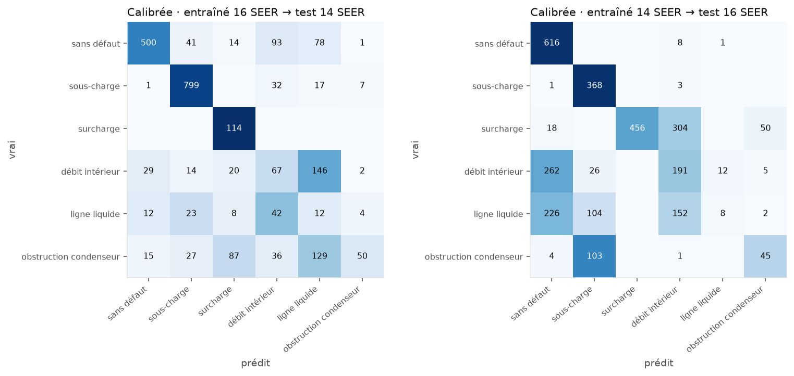

Les deux machines n'ont pas le même mélange de pannes — 856 sous-charges contre 114 surcharges
sur l'une, 372 contre 828 sur l'autre — de sorte que les matrices ne peuvent pas être
additionnées.

La confusion dominante est physique, pas algorithmique : **le défaut de débit d'air et la
restriction de ligne liquide s'échangent massivement**. Les deux affament l'évaporateur, donc
abaissent la pression d'aspiration et la capacité. Sur les grandeurs mesurées, ils se
ressemblent — aucun algorithme ne séparera ce que les capteurs ne distinguent pas.

## La calibration n'est pas un gain uniforme

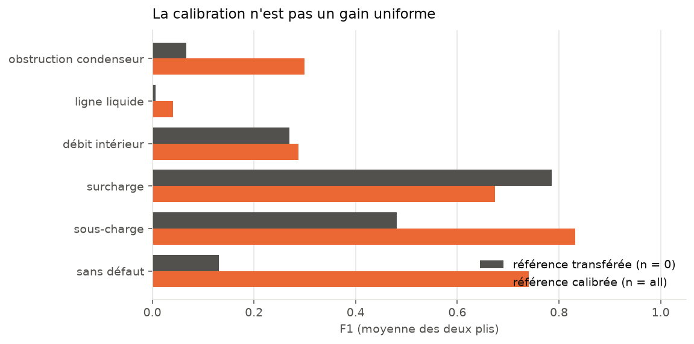

| Panne | Sans calibration | Avec calibration | Écart |
|---|---|---|---|
| Sans défaut | 0,131 | 0,741 | **+0,610** |
| Sous-charge | 0,481 | 0,832 | +0,351 |
| Obstruction condenseur | 0,067 | 0,299 | +0,232 |
| Ligne liquide | 0,007 | 0,040 | +0,034 |
| Débit intérieur | 0,269 | 0,288 | +0,018 |
| **Surcharge** | **0,786** | 0,674 | **−0,111** |

Deux enseignements.

**La calibration sert d'abord à reconnaître l'état sain** : +0,61 sur cette seule classe. C'est
cohérent — sans référence correcte, le modèle juge tout anormal. Sur une machine, il ne prononce
« sans défaut » que dans 2 % des cas.

**Et la surcharge est mieux détectée sans calibration qu'avec** : 0,786 sur une machine
totalement inconnue, cohérent dans les deux sens de transfert. Sa signature — le
sous-refroidissement qui s'envole — est assez marquée pour se passer de référence locale.

Le budget de calibration n'est donc pas un chiffre unique. **Il dépend de la panne cherchée, et
pour l'une d'elles il est nul.**

> **Pour le jury.** C'est ici que le projet devient utilisable. Non parce que les chiffres sont
> bons, mais parce qu'ils sont assez détaillés pour dire à un praticien ce sur quoi il peut
> compter : les défauts de charge, sur une machine jamais vue, dont l'un sans installation
> préalable.

# 12. Conclusion

## Ce que le système fait

Il modélise un cycle thermodynamique complet et en dérive des signatures de panne cohérentes ;
il en fabrique un jeu d'apprentissage ; il diagnostique six classes ; il sert le tout par une
API et un tableau de bord qui se clonent et tournent sans préparation. Son architecture en
couches permet d'ajouter une source de données sans toucher à la méthode — démontré en
pratique, pas seulement affirmé.

Et surtout : il a été **confronté à des mesures indépendantes**, ce qui a produit quatre
corrections de physique et un résultat que la simulation seule ne pouvait pas donner.

## Ce qu'il ne fait pas

- Il ne détecte pas les pannes à 99 % sur le terrain : ce chiffre mesure la séparabilité des
  signatures à l'intérieur du modèle physique, et une partie en est même imputable à une
  information non bruitée qui n'existerait pas sur une machine réelle.
- Il ne fonctionne pas sur une machine inconnue sans calibration préalable.
- Il ne prédit pas les pannes futures : les essais disponibles sont stationnaires, sans axe du
  temps. Leur en inventer un produirait exactement le genre de chiffre que ce travail s'attache
  à ne pas produire.

## La formulation défendable

> Les signatures de défaut sont séparables à 99,6 % en validation croisée sur données simulées.
> Confrontée à des essais mesurés indépendants, la méthode des résidus fait passer la détection
> de 0,33 à 0,60 lorsque la référence saine est calibrée sur la machine cible — contre 0,32
> sans cette calibration, et 0,95 en validation aléatoire, laquelle surestime largement. Le
> coût de cette calibration a été mesuré : il faut couvrir le domaine de fonctionnement, pas
> quelques points.

---

# Annexes

Les parties précédentes racontent le système. Celles-ci permettent de le vérifier. Toutes les
équations sont transcrites de `src/physics/simulator.py`, sans reformulation.

## A. Symboles

| Symbole | Grandeur | Unité | Nominal |
|---|---|---|---|
| $T_{source}$ | Température de la source froide | °C | 7 |
| $T_{sink}$ | Température du puits chaud | °C | 40 |
| $n$ | Régime compresseur rapporté au nominal | — | 0,3 à 1,0 |
| $\varphi_{evap},\ \varphi_{cond}$ | Encrassement (0 = propre, 1 = obstrué) | — | 0 |
| $r_{evap},\ r_{cond}$ | Débit d'air rapporté au nominal | — | 1,0 |
| $c$ | Charge de fluide rapportée au nominal | — | 1,0 |
| $UA$ | Coefficient global d'échange | W/K | 500 / 600 |
| $\tau$ | Taux de compression | — | environ 3 |
| $k$ | Rapport des chaleurs massiques du R-410A | — | — |
| $SH,\ SC$ | Surchauffe, sous-refroidissement | K | 6,0 et 4,5 |

Les six paramètres $\varphi$, $r$ et $c$ sont les **entrées de défaut**. À leurs valeurs
nominales, le cycle est sain.

## B. Le modèle thermodynamique

### B.1 Échangeurs

$$UA_{evap} = 500\,\bigl(1 - 0{,}50\,\varphi_{evap}\bigr)\,r_{evap}^{\,1{,}45}
\qquad
UA_{cond} = 600\,\bigl(1 - 0{,}50\,\varphi_{cond}\bigr)\,r_{cond}^{\,1{,}45}$$

$$\Delta_{evap} = 5 + 7\left(1 - \frac{UA_{evap}}{500}\right)
\qquad
\Delta_{cond} = 5 + 7\left(1 - \frac{UA_{cond}}{600}\right) + 8\,(1 - r_{cond})$$

$$T_{evap} = \mathrm{borne}\bigl(T_{source} - \Delta_{evap},\; -25,\; 20\bigr)
\qquad
T_{cond} = \mathrm{borne}\bigl(T_{sink} + \Delta_{cond},\; 20,\; 65\bigr)$$

Le terme symétrique $8\,(1 - r_{evap})$ côté évaporateur a été **retiré** : il faisait monter la
température de refoulement avec la perte de débit, contre le sens mesuré.

### B.2 Pressions et taux de compression

$$P_{evap} = P_{sat}(T_{evap}) \qquad P_{cond} = P_{sat}(T_{cond})$$

Les défauts de charge agissent sur ces pressions, puis les températures de saturation sont
recalculées pour rester cohérentes :

$$c < 1 : \quad P_{evap} \leftarrow P_{evap}\,(0{,}55 + 0{,}45\,c), \qquad T_{evap} \leftarrow T_{sat}(P_{evap})$$

$$c > 1 : \quad P_{cond} \leftarrow P_{cond}\,\bigl(1 + 0{,}90\,(c-1)\bigr), \qquad T_{cond} \leftarrow T_{sat}(P_{cond})$$

$$\tau = \frac{P_{cond}}{\max(P_{evap},\ 0{,}5)}$$

Une sous-charge affame l'évaporateur et effondre la pression basse ; une surcharge engorge le
condenseur et élève la pression haute. Les deux élargissent $\tau$, mais **par des extrémités
opposées du cycle** — d'où des signatures distinctes.

### B.3 Rendements du compresseur

$$\eta_{is} = 0{,}75\,f(\tau)\,g(n), \qquad
f(\tau) = \mathrm{borne}\bigl(1 - 0{,}05(\tau-3)^2,\,0{,}4,\,1\bigr), \qquad
g(n) = 1 - 0{,}30\,(n-0{,}7)^2$$

$$\eta_{vol} = 1 - C\left(\tau^{1/k} - 1\right), \qquad C = 0{,}05$$

$C$ est le rapport de volumes morts. Le rendement isentropique est maximal autour de
$\tau = 3$ et chute de part et d'autre.

### B.4 Surchauffe et sous-refroidissement

$$SH = 6{,}0\,\bigl(1 + 0{,}85\,\varphi_{evap}\bigr)\bigl(1 - 0{,}20\,(1 - r_{evap})\bigr)$$

$$SC = 4{,}5\,\bigl(1 + 0{,}65\,\varphi_{cond}\bigr)\bigl(1 - 0{,}12\,(1 - r_{cond})\bigr)$$

puis, selon la charge :

$$c < 1 : \quad SH \leftarrow SH\,\bigl(1 + 1{,}4\,(1-c)\bigr), \qquad SC \leftarrow SC\,\max(c,\,0{,}25)$$

$$c > 1 : \quad SH \leftarrow SH\,\max\bigl(1 - 1{,}4\,(c-1),\,0{,}25\bigr), \qquad SC \leftarrow SC\,\bigl(1 + 2{,}2\,(c-1)\bigr)$$

$$SC \leftarrow \max(SC,\ 0{,}4)$$

Lecture physique de chaque terme :

| Terme | Effet | Pourquoi |
|---|---|---|
| $+0{,}85\,\varphi_{evap}$ sur $SH$ | Encrassement évaporateur : surchauffe **monte** | La zone diphasique s'allonge |
| $-0{,}20\,(1-r_{evap})$ sur $SH$ | Moins d'air : surchauffe **baisse** | Moins de chaleur absorbée en fin d'évaporateur |
| $+0{,}65\,\varphi_{cond}$ sur $SC$ | Obstruction condenseur : $SC$ **monte** | Le liquide s'accumule faute d'évacuer la chaleur |
| $-0{,}12\,(1-r_{cond})$ sur $SC$ | Ventilateur condenseur : effet faible | La panne élève surtout $T_{cond}$ |
| $\max(c,\,0{,}25)$ sur $SC$ | Sous-charge : $SC$ **s'effondre** | Plus assez de liquide à sous-refroidir |
| $+2{,}2\,(c-1)$ sur $SC$ | Surcharge : le plus fort effet du modèle | Le liquide excédentaire s'empile |

Les termes en gras sont ceux qui ont été **corrigés après confrontation aux mesures**. Le modèle
initial les avait en sens inverse, ou absents.

### B.5 Bornes du compresseur

$$T_{asp} = T_{evap} + SH$$

$$T_{ref}^{\,ideal} = \bigl(T_{asp} + 273{,}15\bigr)\,\tau^{\frac{k-1}{k}} - 273{,}15$$

$$T_{ref} = T_{asp} + \frac{T_{ref}^{\,ideal} - T_{asp}}{\eta_{is}}
            + 10\,(1 - r_{cond}) - 25\,(1 - r_{evap})$$

$$T_{ref} \leftarrow \min\bigl(T_{ref},\ 130\bigr)$$

Les deux termes correctifs sont **calibrés sur les essais mesurés**, non dérivés : la perte de
débit au condenseur réchauffe le refoulement, celle à l'évaporateur refroidit l'aspiration. Ils
sont énoncés comme des paramètres ajustés.

Le plafond à 130 °C est l'enveloppe constructeur. Il était déclaré sans jamais être appliqué.

### B.6 Débit, enthalpies, puissances

$$\dot m = V_{sw}\,f_{nom}\,n\,\rho_{asp}\,\eta_{vol}
\times \begin{cases}
0{,}55 + 0{,}45\,c & c < 1\\[2pt]
1 + 0{,}25\,(c-1) & c > 1\\[2pt]
0{,}75 + 0{,}25\,r_{evap} & r_{evap} < 1
\end{cases}$$

$$h_1 = h_{vap}^{sat}(T_{evap}) + c_{p,vap}\,SH
\qquad
h_3 = h_{liq}^{sat}(T_{cond}) - 1{,}5\,SC
\qquad
h_4 = h_3$$

$$\Delta h_{ideal} = c_{p,vap}\bigl(T_{ref}^{\,ideal} - T_{asp}\bigr)
\qquad
\Delta h_{reel} = \frac{\Delta h_{ideal}}{\eta_{is}}
\qquad
h_2 = h_1 + \Delta h_{reel}$$

$$Q_{evap} = \dot m\,(h_1 - h_4)
\qquad
Q_{cond} = \dot m\,(h_2 - h_3)
\qquad
W_{comp} = 1{,}10\,\dot m\,\Delta h_{reel}
\qquad
COP = \frac{Q_{cond}}{W_{comp}}$$

Le facteur 1,10 couvre les pertes mécaniques et électriques. La détente $h_4 = h_3$ est
supposée isenthalpique, hypothèse standard pour un détendeur.

### B.7 Bruit de mesure, et une incohérence connue

Bruit gaussien : $\pm 0{,}5$ °C sur les températures, 2 % sur les pressions, 3 % sur les
puissances. Il est appliqué **après** le calcul des grandeurs dérivées, qui ne sont pas
recalculées.

| Grandeur dérivée | Lignes cohérentes avec ses entrées |
|---|---|
| `pressure_ratio`, `compression_ratio` | 0 % |
| `COP` | 0 % |
| `delta_T_evap`, `delta_T_cond` | 0 % |

Aucune ligne ne vérifie $\texttt{pressure\_ratio} = P_{cond}/P_{evap}$. Comme ces grandeurs
portent **76,4 % de l'importance du modèle** (partie 4), une part du taux de réussite provient
d'une information indisponible sur une machine réelle. Anomalie connue, non corrigée à ce jour,
planifiée.

## C. Méthodes de validation

### C.1 Le résidu

$$\tilde{x} = x_{observe} - \hat{x}_{sain}\bigl(T_{source},\,T_{sink},\,n\bigr)$$

Cinq résidus entrent dans le vecteur : `d_T_discharge`, `d_superheat`, `d_subcooling`,
`d_COP`, `d_W_comp`. La question décisive est l'origine de $\hat{x}_{sain}$ :

| Origine | Ce que cela suppose | Score |
|---|---|---|
| Simulée | Le modèle physique est exact | non mesurable sur du réel |
| Essais sains de la machine cible | La machine a été observée saine | 0,602 |
| Essais sains d'une autre machine | Rien | 0,318 |

### C.2 Le modèle de référence sain

$$\hat{x}_{sain}(T_{source}, T_{sink}) = \mathrm{med}\Bigl\{x_i \;:\; i \in \mathcal{V}_k\Bigr\},
\qquad k = \min(5,\,n)$$

où $\mathcal{V}_k$ désigne les $k$ essais sains les plus proches dans le plan
$(T_{source}, T_{sink})$. Des formes plus riches n'améliorent pas le transfert : polynôme
d'ordre 2 avec point de rosée 0,302 ; forêt aléatoire 0,265 ; contre 0,318 pour le plus proche
voisin. **Le plafond n'est pas une limite du modèle de référence, c'est une limite du transfert
entre machines.**

### C.3 Les deux protocoles

| Protocole | Ce qu'il autorise le modèle à apprendre | Score |
|---|---|---|
| CV aléatoire | La panne **et** l'identité de la machine | 0,95 |
| Leave-one-machine-out | La panne seule | 0,60 |

### C.4 L'accord des sens de variation

$$x = \beta_0 + \beta_1\,L + \beta_2\,T_{source} + \beta_3\,T_{sink}$$

$L$ est le niveau de défaut ; $\beta_2$ et $\beta_3$ neutralisent les conditions d'essai. On
compare $\mathrm{signe}(\beta_1)$ mesuré au signe de la pente simulée. Indicateur insensible au
décalage de domaine, puisqu'il ne compare que des directions.

Score avant correction : 12 sur 16. Après : **20 sur 22**.

### C.5 Le budget de calibration

Leave-one-machine-out dans les deux sens ; référence construite sur $n$ essais sains de la
machine testée, **retirés du jeu de test** ; vingt tirages par valeur de $n$.

Contrôles du protocole : $n = 0 \rightarrow 0{,}318$ et $n = \text{tous} \rightarrow 0{,}602$,
retrouvés exactement.

## D. Reproduire les chiffres

| Chiffre | Où |
|---|---|
| 99,6 % simulé | `main_analysis.py` |
| 0,95 / 0,602 / 0,318 | `EDA/EDA_NIST_model.ipynb`, `EDA_NIST_reference.ipynb` |
| Accord des signes 20/22 | `EDA/EDA_NIST_model.ipynb` |
| Budget de calibration | `EDA/EDA_NIST_calibration.ipynb` |

Les classeurs NIST ne sont pas versionnés. Adresses de téléchargement et table de correspondance
des 98 colonnes dans `docs/NIST_MAPPING.md`.
