# 0. The problem and the founding constraint

A heat pump rarely fails all at once. It degrades. The condenser fouls, a slow leak empties
part of the charge, a fan weakens. The machine keeps heating, and uses more and more
electricity for the same service. The **COP** — heat delivered divided by electricity
consumed — slips from 4.0 to 3.2 over a few months. Nobody sees it; the bill rises by 25%.

The technician does not need to learn that there is a problem. They need to know
**which one**. That is hard because very different faults look alike: a fouled condenser and
a failed condenser fan both raise the high-side pressure and drop the COP. One is fixed
with a cleaning, the other with a part.

## The constraint that governs everything else

To learn to name a fault, labelled examples are required. Those data are **rare and
expensive**: a condenser has to be fouled on purpose, charge removed, a fan restricted, and
the machine instrumented while it is being damaged. Few laboratories do it.

This project answers with simulation. That is not a workaround. It is **the standard answer
in the field** — NIST and ASHRAE do the same, and the scarcity of fault data is precisely
what motivates their test campaigns.

But the choice creates a tension that has to be stated at the outset: **if the same model
manufactures the questions and the answers, what exactly is being measured?** The second
half of this document is about nothing else.

## How to read this document

The system is walked through module by module, in the order a measurement travels. At each
step, three questions:

| | |
|---|---|
| **Physics** | Which phenomenon is modelled, with which equation |
| **Learning** | Which modelling decision that imposes |
| **Engineering** | Why this code lives here and not elsewhere |

## Repository layout

```
heat-pump-fdd/
|
+-- src/
|   +-- physics/                 the physical model — imports nothing from the project
|   |   +-- simulator.py           R-410A cycle, fault injection
|   |   +-- thermo_lab.py          COP sweeps, envelopes
|   |   +-- thermodynamic_viz.py   pressure-enthalpy diagrams
|   |
|   +-- fdd/                     the method — shared by every study
|   |   +-- features.py            the 23-quantity contract, residuals
|   |   +-- ml_models.py           training, model selection
|   |   +-- inference.py           FDDEngine: load, diagnose
|   |   +-- visualization.py       training figures
|   |
|   +-- studies/                 the datasets
|       +-- synthetic/
|           +-- generator.py       sampling, injection, assembly
|           +-- taxonomy.py        the fault classes of this study
|           +-- scenarios.py       the demo: simulate_cycle, live_trace
|           +-- paths.py           single source of artefact paths
|
+-- api/            FastAPI — 4 inference routes, 17 dashboard routes
+-- web/            React — reads the feature list from the API
+-- tests/          43 tests, including 5 architecture guards
+-- EDA/            notebooks confronting the measured tests
+-- docs/           technical documentation and this dossier
|
+-- outputs/synthetic/   dataset and figures, per study
+-- models/synthetic/    serialised model and its metadata
```

The import rule is one-directional and checked by tests:

$$\texttt{studies/} \;\longrightarrow\; \texttt{fdd/} \;\longrightarrow\; \texttt{physics/}$$

# 1. The physics — `src/physics/`

## `simulator.py` — the source of truth

This module computes an R-410A vapour-compression cycle. It is the root of the dependency:
everything rests on it, it rests on nothing. Fluid properties come from CoolProp, with
fallback correlations.

Three inputs define an operating point:

| Input | Range | Meaning |
|---|---|---|
| $T_{source}$ | −10 to 20 °C | Outdoor air, cold side |
| $T_{sink}$ | 30 to 55 °C | Heating water, hot side |
| $n$ | 0.3 to 1.0 | Compressor speed ratio |

The nominal point is **A7/W40**: air at 7 °C, water at 40 °C.

### The heat-exchanger model, and the exponent that does the work

$$UA_{evap} = UA_{evap}^{nom}\,\bigl(1 - 0.50\,\varphi_{evap}\bigr)\; r_{evap}^{\,1.45}$$

$$UA_{cond} = UA_{cond}^{nom}\,\bigl(1 - 0.50\,\varphi_{cond}\bigr)\; r_{cond}^{\,1.45}$$

with $UA_{evap}^{nom} = 500$ W/K and $UA_{cond}^{nom} = 600$ W/K; $\varphi$ the fouling
(0 = clean) and $r$ the airflow relative to nominal.

**Physics.** $UA$ is the overall heat-transfer coefficient: how much heat passes per degree
of difference. Fouling lays down an insulating layer and degrades it **linearly**. A loss of
airflow degrades it with an **exponent 1.45**, because air-side convection collapses faster
than in proportion to the flow.

**Learning. This is the heart of the project.** The two faults degrade the same quantity,
but by two different laws. *That* difference is what makes the classes separable. Without
it there is no classification problem — only two names for one symptom.

The temperature difference across the exchanger, the *pinch*, follows:

$$\Delta_{evap} = 5 + 7\left(1 - \frac{UA_{evap}}{UA_{evap}^{nom}}\right)$$

$$\Delta_{cond} = 5 + 7\left(1 - \frac{UA_{cond}}{UA_{cond}^{nom}}\right) + 8\,(1 - r_{cond})$$

then the phase-change temperatures:

$$T_{evap} = T_{source} - \Delta_{evap} \qquad T_{cond} = T_{sink} + \Delta_{cond}$$

**Remember: the condenser is on the hot-sink side.** That convention becomes a trap when
the model is confronted with cooling-mode measurements, where the outdoor unit plays that
role.

### The compressor

Isentropic efficiency follows a scroll-compressor correlation, maximum around a pressure
ratio $\tau = 3$:

$$\eta_{is} = 0.75 \cdot f(\tau) \cdot g(n), \qquad
f(\tau) = \mathrm{clamp}\bigl(1 - 0.05\,(\tau-3)^2,\; 0.4,\; 1\bigr), \qquad
g(n) = 1 - 0.30\,(n - 0.7)^2$$

$$\eta_{vol} = 1 - 0.05\left(\tau^{1/k} - 1\right), \qquad \tau = \frac{P_{cond}}{P_{evap}}$$

**Useful reading**: a fault that moves $\tau$ away from its optimum degrades the COP
**twice** — through the thermodynamics, and through the drop in compressor efficiency.

Discharge temperature follows a polytropic law corrected by that efficiency:

$$T_{dis}^{\,ideal} = \bigl(T_{suc} + 273.15\bigr)\,\tau^{\frac{k-1}{k}} - 273.15
\qquad
T_{dis} = T_{suc} + \frac{T_{dis}^{\,ideal} - T_{suc}}{\eta_{is}}$$

A less efficient compressor turns more work into heat: it discharges hotter. That is why
discharge temperature is so sensitive a health indicator.

### Powers and COP

$$Q_{cond} = \dot m\,(h_2 - h_3) \qquad
W_{comp} = 1.10 \cdot \dot m\,\Delta h_{real} \qquad
COP = \frac{Q_{cond}}{W_{comp}}$$

The factor 1.10 covers mechanical and electrical losses. Enthalpy detail is in appendix B.

### A fault is not noise

A fault is a **physical parameter degraded upstream** — $\varphi_{cond}$, $r_{cond}$, the
charge $c$ — and every quantity follows consistently. One line changes in the call, and the
whole cycle is recomputed.

**Engineering.** That is what makes it possible to explore a fault continuously, at any
severity and in any conditions — which no set of real tests allows.

### What the confrontation with measurements revealed

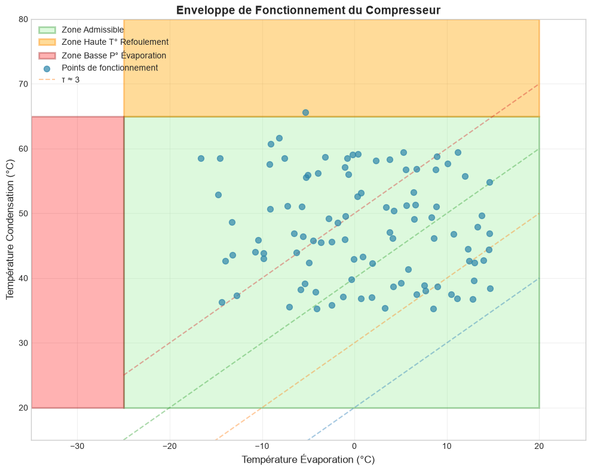

Four modelling faults, found by comparing simulated signatures with measured tests, then
fixed:

| Fault found | Consequence |
|---|---|
| Overcharge with no calculation branch | A declared class that produced no effect |
| Subcooling reversed on condenser fouling | One feature varied the wrong way |
| Superheat and discharge reversed on the evaporator fan | Two features the wrong way |
| Discharge ceiling declared but never applied | Cycles at 319 °C in the training data |

The last is the most instructive: $T_{dis}^{max} = 130$ °C was in the code, but used only
to display a warning — never to bound the value. Part of the examples described machines
that cannot exist.

## `thermodynamic_viz.py` and `thermo_lab.py` — views, not physics

Pressure-enthalpy diagrams and COP sweeps. They live in `physics/` because they handle the
same fluid properties, but they are imported by the API and **never by the learning
pipeline**. A visualisation does not enter a feature vector.

# 2. From the cycle to the vector — `src/fdd/features.py`

## The representation problem

A cycle result is not a usable vector. One has to decide **what** to show the model — and
that choice weighs more than the choice of algorithm.

The contract has 23 columns: 3 conditions, 15 measured or derived quantities, 5
**residuals**. `pressure_ratio` was removed: it was the same number as `compression_ratio`.

## Residuals, or the fever analogy

Saying "37.8 °C" means nothing until one knows who is being talked about. Saying "0.9 °C
above their usual temperature" is a signal, whoever the person is.

$$\tilde{x} = x_{observed} - \hat{x}_{healthy}\bigl(T_{source},\, T_{sink},\, n\bigr)$$

A superheat of 12 K says nothing: it depends on the machine, the season, the load. A
superheat **1.7 K above what this machine would do when healthy, right now** is an
undercharge signature.

**Learning.** This is the Li and Braun residual method: a reference model predicts healthy
behaviour, and the classifier works on the gap. The module docstring names it.

## The seam that makes the whole validation possible

```python
def cycle_to_features(result, ..., baseline=None, ...):
    if baseline is None:
        baseline = healthy_cycle(T_source, T_sink, speed_ratio)   # <- simulates
```

**By default, the healthy reference cycle is computed by the simulator.** Both terms of the
subtraction come out of the same calculating machine: that is the circularity announced at
the start.

But the `baseline` parameter is exposed. Passing a **measured** healthy cycle turns the five
residuals into real gaps, without changing a line of the rest of the pipeline.

**Engineering.** A single line of signature is what made the confrontation in part 7
possible. It is the clearest example, in this project, of what a good extension point buys.

## A redundancy

$\texttt{compression\_ratio}$ and $\texttt{pressure\_ratio}$ were **the same number**,
checked to machine precision on 100% of the 5000 rows. `pressure_ratio` was removed from
the contract (P5). Switching to residuals alone would lose seven points: there is only one
simulated machine, nothing to re-identify.

# 3. Building a dataset — `src/studies/synthetic/`

## Why a separate "studies" layer

A dataset is not a file. It is a triplet: **data, a fault taxonomy, an artefact location**.
The day a second source arrives, nothing in the method should move. That is the
justification of the architectural split, and it is checkable.

| Module | Role |
|---|---|
| `generator.py` | Sampling conditions, injecting faults, assembling |
| `taxonomy.py` | Fault classes and their parameters — specific to the study |
| `scenarios.py` | The demo: `simulate_cycle`, `live_trace` — not the method |
| `paths.py` | Single source of paths, no hardcoded path elsewhere |

Conditions are drawn uniformly in the domain, a fault is chosen then injected at a drawn
severity, and the cycle is recomputed.

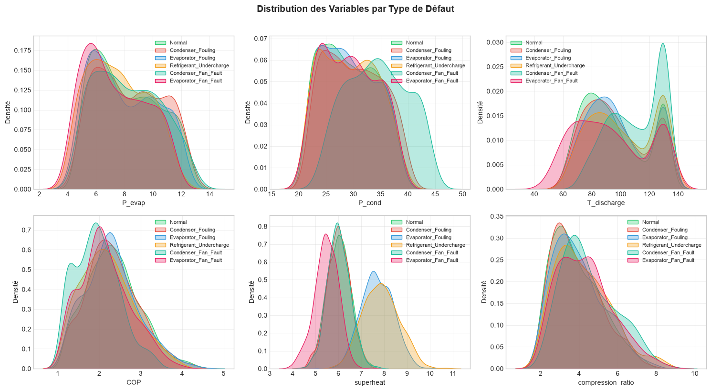

Seven classes are produced: healthy, condenser fouling, evaporator fouling, undercharge,
**overcharge**, condenser fan, evaporator fan. Overcharge has been generated since P4,
after removing a parasitic `condenser_fouling` that contaminated every sample. Valve leak
was **removed**: the simulator has no volumetric-efficiency parameter, and the old branch
was a mix of undercharge and evaporator fouling.

## Measurement noise

Gaussian noise is added to the quantities a sensor measures: 0.5 °C on temperatures, 2% on
pressures, 3% on powers. It models neither sensor drift, nor bias, nor transient regime.

**Derived quantities are recomputed after that noise**, and the healthy reference of the
`d_*` residuals is noised independently. On the 5000 examples, every row satisfies
$\texttt{compression\_ratio} = P_{cond}/P_{evap}$ and $COP = Q_{cond}/W_{comp}$.

Before that correction, `d_COP` was noised on neither side: it was exactly 0 for the 2000
healthy tests, and for them alone. A one-leaf tree separated fault from healthy at 100%.
That was the detection label in clear text inside the input vector. The 99.6% published
then was invalid. The honest figure, after the four pipeline leaks were closed, was
**91.9% [90.4 – 93.1]** on six classes. P4 added overcharge: the delivered figure is
**89.3% [87.6 – 90.7]** (hold-out, selection on val, seven classes).

What remains inside the model is the next part.

# 4. The model — `src/fdd/ml_models.py` and `inference.py`

## The choice of algorithm, and why it matters little

Random forest, selected on the validation set. Gradient boosting tied on val
(ΔF1 = 0.002) — split on inference and interpretability. Scaler and classifier live in a
`sklearn.Pipeline`. Split 2625 / 875 / 1500 (train / val / test). The test is never used
to choose.

| Model | Test accuracy | 95% CI | Test F1 | Val F1 |
|---|---|---|---|---|
| **Random forest (shipped)** | **89.3%** | 87.7 – 90.8 | 0.871 | 0.905 |
| Gradient boosting | 89.9% | 88.2 – 91.3 | 0.879 | 0.902 |

5-fold cross-validation **on the train set only**: F1 0.881 ± 0.017.

**Why not twelve algorithms.** The two candidates are tied on val (ΔF1 = 0.003). Stacking
algorithms would have given an **illusion of rigour**. The useful work was in the protocol:
do not choose on the test, publish an interval.

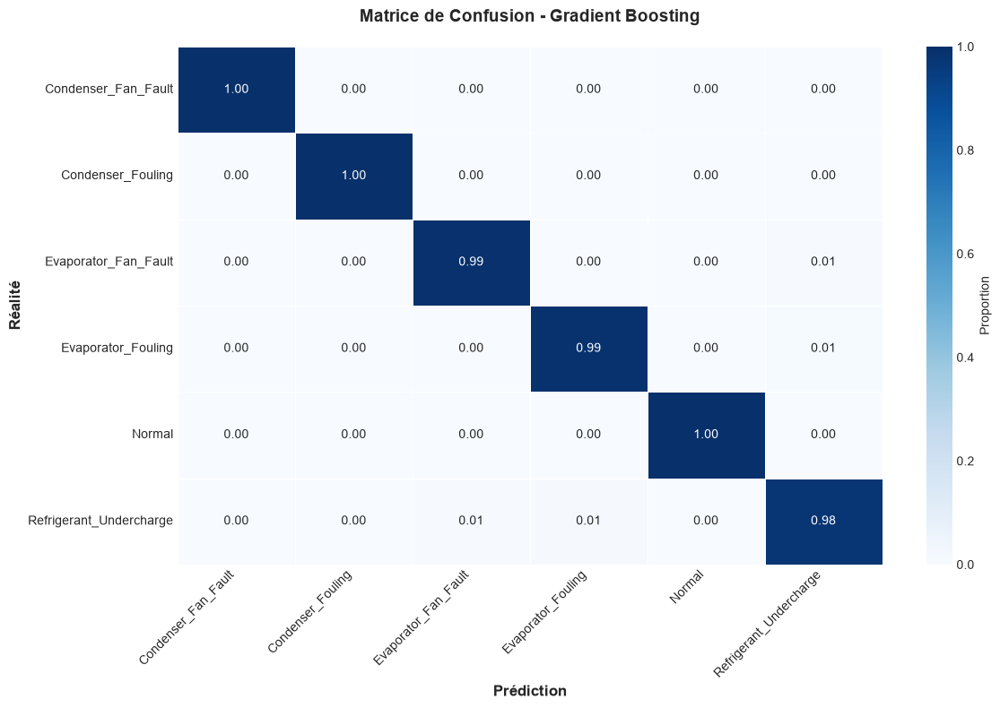

The confusion matrix is no longer nearly perfect. The fans stay separated (F1 0.97);
overcharge is detected (F1 0.88) and is not confused with condenser fouling (11 / 150 and
9 / 150 in the two directions) once the artificial coupling is removed. The two foulings
remain the hard classes (0.71 and 0.79). That is physics: both raise the high-side
pressure.

## What the model actually uses

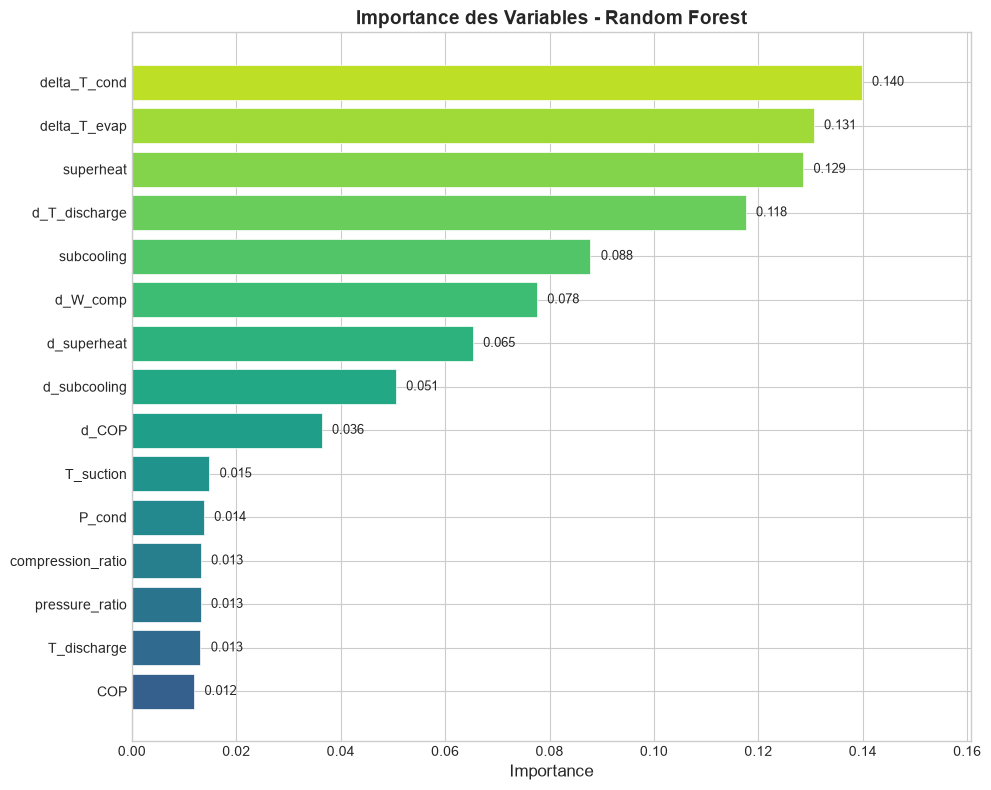

This figure is the most instructive of the simulated set, for two reasons.

**First, 18 of the 24 quantities have almost zero importance.** The model uses six. The
feature contract is therefore largely oversized, which prepares a simplification (P5).

**Second, `d_COP` is no longer the pillar of the decision.**

| Rank | Quantity | Importance |
|---|---|---|
| 1 | `delta_T_cond` | 0.140 |
| 2 | `delta_T_evap` | 0.131 |
| 3 | `superheat` | 0.129 |
| 4 | `d_T_discharge` | 0.118 |
| 5 | `subcooling` | 0.088 |
| 6 | `d_W_comp` | 0.078 |
| 9 | `d_COP` | **0.036** |

Before the correction, `d_COP` + `delta_T_cond` + `delta_T_evap` carried 76% of the
importance, and all three were free of noise. After the derived quantities are recomputed,
`d_COP` falls to 3.6%. The pinches stay useful — they are now consistent with the noised
temperatures.

## `FDDEngine` — load and diagnose, nothing else

The engine loads a model and assigns a class to a vector. It does not know how to simulate
a fault: that belongs to the study.

That separation did not always exist. The engine originally contained the fault generator,
which made the shared layer depend on one particular study and forbade adding a second.
The decoupling was done **before** any file was moved, and five tests stop it coming back.

## The versioned model and the load-bearing pin

The trained model is **serialised and versioned in the repository**, so the project clones
and runs without retraining. That format depends on the exact library version, pinned at
`scikit-learn==1.6.1`. Another version makes the model unreadable, with an error that does
not look like a version problem:

```
ModuleNotFoundError: No module named '_loss'
```

The Docker image is protected because it installs from the dependency file; a local
environment that has drifted is not.

# 5. Serving — `api/` and `web/`

| Family | Count | Role |
|---|---|---|
| Inference | 4 | `/health`, `/predict`, `/simulate`, `/live` |
| Dashboard | 17 | `/api/*` — feed the views |

Twenty-one routes in a 582-line module, for two responsibilities: the seam of a future
split is clear.

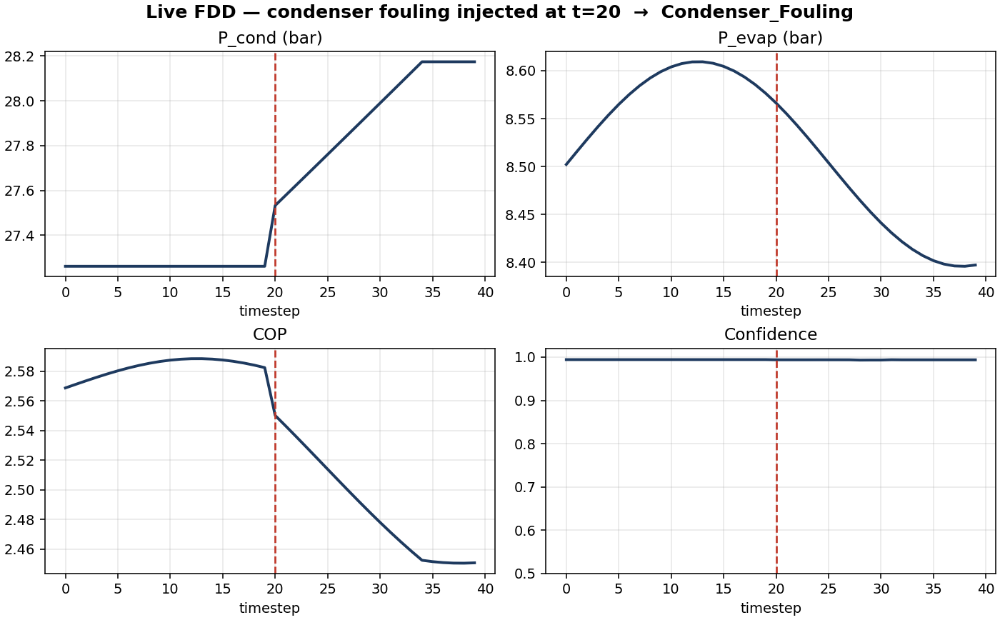

P7 adds an **Evidence** page (`/evidence`) that no longer calls the classifier: it reads
`outputs/results.csv` and shows the truth ladder 99.6% → 89.3% → 60.2% → 31.8%.
Narrative, captures, and protocols: [FRONT_EVIDENCE.md](FRONT_EVIDENCE.md)
([PDF](FRONT_EVIDENCE.pdf)).

**The input contract is strict.** `/predict` enumerates the 23 quantities and refuses any
unknown field — a misnamed quantity is rejected rather than ignored. That makes any
evolution of the contract a **compatibility break**.

**The front is generic**: it reads the feature list from the API. It will follow an
evolution without a change.

# 6. The rule that holds the whole thing

$$\texttt{studies/} \;\longrightarrow\; \texttt{fdd/} \;\longrightarrow\; \texttt{physics/}$$

`physics/` imports nothing from the project; `fdd/` may import `physics/`; only `studies/`
may import both.

**What the rule forbids**: that the method depend on one particular dataset.

**What maintains it**: five tests that fail if the coupling comes back — the engine must
not expose a simulation interface, the features module must not contain a study taxonomy,
the trainer must not import a generator.

## The story of the refactor

The order mattered more than the content:

1. **Decouple first**, without moving a file.
2. **Move next**, without changing a line of logic.
3. **File artefacts by study** last.

Reversing the first two steps would have drowned an architecture decision in a dozen
renames.

**Behavioural equivalence was checked at every step** by comparing outputs before and
after — six fault types, their 24 quantities, the predicted class, the confidence, a time
trace. Identical byte for byte.

> **For the jury.** A refactor is not judged on the elegance of the result but on the proof
> that nothing moved. Here the proof is a binary comparison of the outputs, not a green
> test suite: the tests say the contract holds, not that the numbers are the same.

# 7. The measured data

Validation rests on a public NIST campaign: residential heat pumps in a climate chamber,
with faults imposed and held.

| | |
|---|---|
| Tests | 7375 |
| Quantities | 98 columns, air side and refrigerant side |
| Machines | Two, of different performance |
| Kept | 5386 single-fault tests, 6 classes |
| Mode | Cooling |

Two machines rather than one: that is decisive, because it makes it possible to test
whether a model learned on one works on the other.

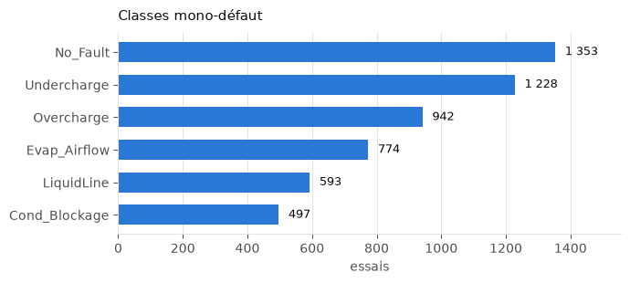

The classes are not given: they are **implicit**, spread across five level columns where
100% means nominal. A fault counts as active as soon as its level departs by more than
2% — a threshold that reproduces exactly the published counts, which lets it be written as
an assertion in the code.

## Three methodological obstacles

**The mode is reversed.** The tests are in cooling, the simulator in heating. In cooling,
the **outdoor** unit condenses — the opposite of the simulator's convention. Pairing faults
without checking that point leads to comparing opposite directions and concluding that the
model is wrong when the pairing is.

**One sensor is not instrumented on one of the two machines.**

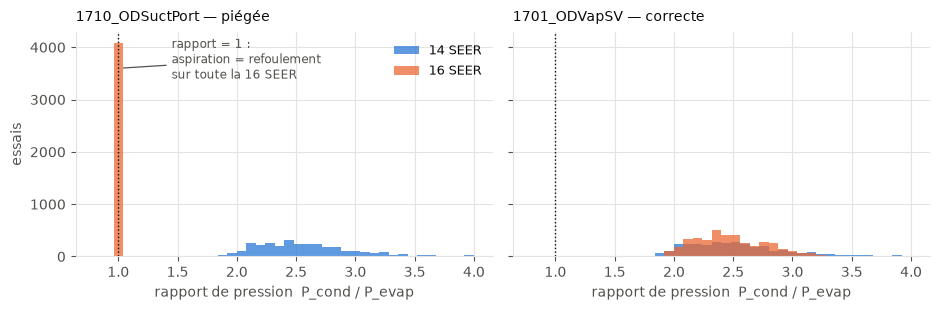

The column named "suction-port pressure" actually contains the discharge pressure on one of
the two machines, 55% of the tests. The pressure ratio there is exactly 1.00 — physically
impossible — without any error being raised. The left panel shows the peak at 1.00; the
right panel, the replacement column, consistent on both machines.

**The domains overlap by 5.3%.**

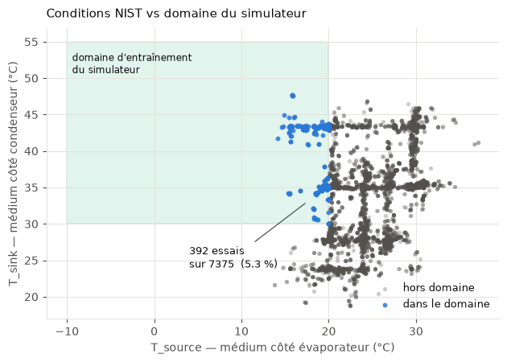

The rectangle is the domain the simulator was trained on; the points are the measured
tests. They fall almost entirely outside. **Comparing absolute values is therefore ruled
out**; only the trends are comparable.

Finally, the fault-level columns are the answer to be found: including them among the
inputs would hand out the solution with the question. They are excluded, and a test checks
it.

# 8. The validation protocols

A score means nothing without its protocol.

**Random cross-validation**: all tests are mixed, and part of them is hidden. Standard, and
misleading here, because tests from both machines end up on both sides — the model can
learn to recognise *the installation* rather than *the fault*.

**Validation by machine** (*leave-one-machine-out*): train on one machine, test on the
other, then reverse.

The analogy is a student. Revising past papers and then sitting an exam drawn from the same
papers gives a good mark. Sitting another school's paper measures what was understood.

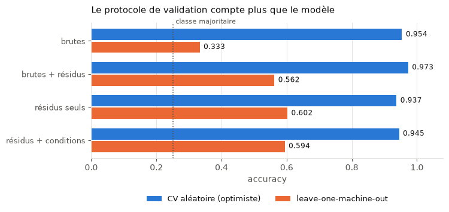

| Feature set | Random CV | By machine |
|---|---|---|
| Raw quantities | 0.954 | 0.333 |
| Raw and residuals | 0.973 | 0.562 |
| Residuals only | 0.937 | 0.602 |
| Residuals and conditions | 0.945 | 0.594 |

Majority class: 0.251.

Two readings. **The set that wins in random validation is not the one that transfers
best**: ranking designs on a random draw would have kept the wrong one. And **adding the
absolute quantities to the residuals degrades transfer**, because the absolute values make
it possible to re-identify the machine.

> **For the jury.** A gap from 0.95 to 0.60 between two protocols, same model and same
> data, does not measure the model. It measures the protocol.

# 9. The results, and the module each one implicates

## Agreement of the signs of variation implicates `simulator.py`

The 5.3% overlap rules out absolute values, so **directions** are compared. For each fault
and each quantity, the measured tests are fit with:

$$x = \beta_0 + \beta_1\,L + \beta_2\,T_{source} + \beta_3\,T_{sink}$$

where $L$ is the fault level. The last two terms neutralise the test conditions, so that
$\beta_1$ isolates the effect of the fault. $\mathrm{sign}(\beta_1)$ is compared with the
sign of the slope obtained by sweeping the same parameter in the simulator.

| | Agreement |
|---|---|
| Before the correction | **12 out of 16** |
| After the four faults were fixed | **20 out of 22** |

The denominator rises because overcharge, inert until then, now produces usable signals.

**This result directly drove a rewrite of the code.** That is the point of an external
confrontation: it does not grade the model, it points at which line to fix.

## The gain from residuals validates `features.py`

Moving from raw quantities to residuals raises detection from 0.333 to 0.602, for 1.7
points lost in random validation. The design choice of the features module is validated
**on real measurements**, not by a theoretical argument.

## The degradation of the raw quantities implicates `FEATURE_COLUMNS`

Mixing absolutes and residuals drops transfer from 0.602 to 0.562. The current contract
contains exactly that mix. The measurement points at a change to make — which the feature
importance in part 4 confirms by another path.

## The result that reorients the project

A later check showed that the 0.602 rested on an implicit assumption: the healthy
reference — the "usual temperature" of the analogy — was computed from healthy tests **of
the machine under test**.

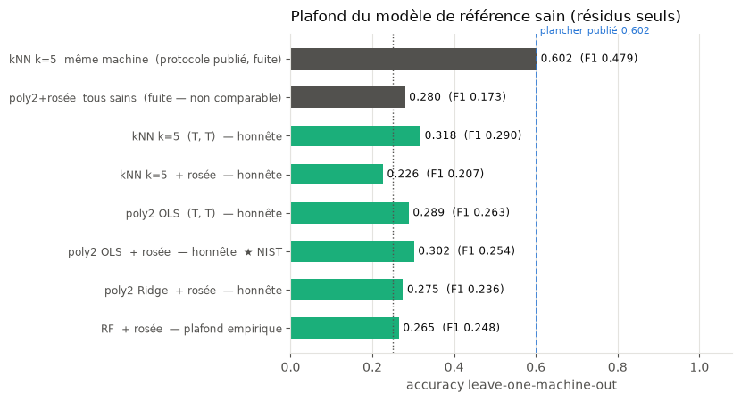

Rebuilt from the training machine alone, that is, facing a genuinely unknown machine,
performance collapses. And **no form of reference model lifts that ceiling**: neither the
order-2 polynomial with dew point that NIST itself describes, nor a regularised regression,
nor a random forest.

| Origin of the healthy reference | Accuracy | F1 macro |
|---|---|---|
| Healthy tests of the target machine | 0.602 | 0.479 |
| Transferred reference, nearest neighbour | **0.318** | 0.290 |
| Order-2 polynomial with dew point | 0.302 | 0.254 |
| Random forest with dew point | 0.265 | 0.248 |

This is not a failure. It is a measurement.

> **For the jury.** The gap between 0.602 and 0.318 is the main result of this work. It
> does not say the method fails. It says what the method requires: a healthy calibration on
> the machine in service. A method whose price is known is usable; a method whose condition
> is unknown is not.
>
> The 0.602 itself carries a further condition, measured since and detailed in **section
> 13**: it assumes a healthy measurement at the very condition of the fault. On a machine
> in service, the realistic value is between 0.43 and 0.52.

# 10. The calibration budget

If diagnosis requires having observed the machine while healthy, the industrial question
becomes: **how long?**

Protocol: validation by machine in both directions; the healthy reference is built on $n$
healthy tests drawn from the machine under test; those $n$ tests are **removed from the
test set**, otherwise they would serve as both calibration and evaluation; twenty draws per
value of $n$, mean and interval.

The two bounds are the control: $n = 0$ must fall back to 0.318 and $n = \text{all}$ to
0.602. Both were recovered exactly.

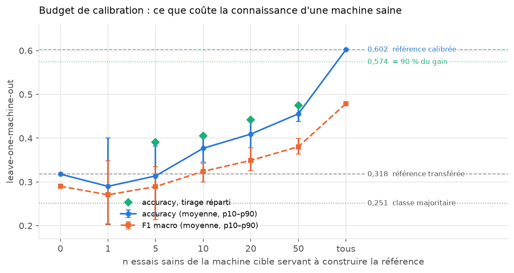

| $n$ healthy tests | Accuracy | F1 macro |
|---|---|---|
| 0 — transferred reference | 0.318 | 0.290 |
| 10 | 0.377 | 0.324 |
| 50 | 0.456 | 0.380 |
| all | 0.602 | 0.479 |

**Fifty healthy tests recover only about 49% of the gap.** Reaching 90% takes essentially
the whole set. At small $n$, the interval is very wide: an unlucky draw does worse than no
calibration at all. Spreading the tests across the operating domain rather than drawing
them at random helps most in that region — the diamonds on the figure.

The field reading is direct: **a handful of commissioning measurements is not a
calibration.** Coverage of the domain is what matters — a deployment constraint, not a
limit of the algorithm.

# 11. Which faults are actually detected

A mean of 0.602 for a macro F1 of 0.479: twelve points of gap, so classes diagnosed very
unevenly. The detail entirely changes what the system can claim.

## By class, calibrated reference

| Fault | Precision | Recall | F1 | n |
|---|---|---|---|---|
| **Undercharge** | 0.748 | 0.961 | **0.832** | 1228 |
| No fault | 0.722 | 0.837 | 0.741 | 1352 |
| **Overcharge** | 0.735 | 0.775 | **0.674** | 942 |
| Condenser blockage | 0.611 | 0.220 | 0.299 | 497 |
| Indoor airflow | 0.269 | 0.313 | 0.288 | 774 |
| **Liquid line** | 0.206 | 0.068 | **0.040** | 593 |

**Charge faults carry the whole result.** Undercharge is consistent in both transfer
directions — 0.91 and 0.76 — so it is not the artefact of one particular machine.

**Liquid-line restriction is never detected**: eight true positives out of 492 tests in
one direction. It is also, and this is not a coincidence, the only fault in the measured
set that the simulator does not model.

## What the failures are confused with

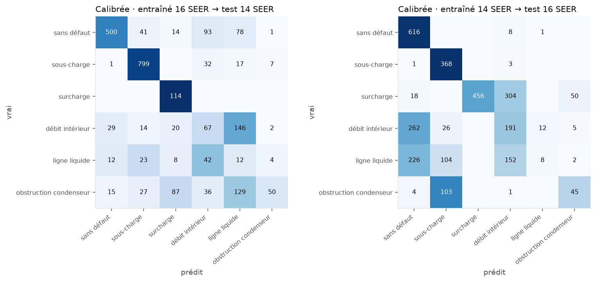

The two machines do not have the same mix of faults — 856 undercharges against 114
overcharges on one, 372 against 828 on the other — so the matrices cannot be added.

The dominant confusion is physical, not algorithmic: **the airflow fault and the
liquid-line restriction swap places heavily**. Both starve the evaporator, so both lower
suction pressure and capacity. On the measured quantities they look alike — no algorithm
will separate what the sensors do not distinguish.

## Calibration is not a uniform gain

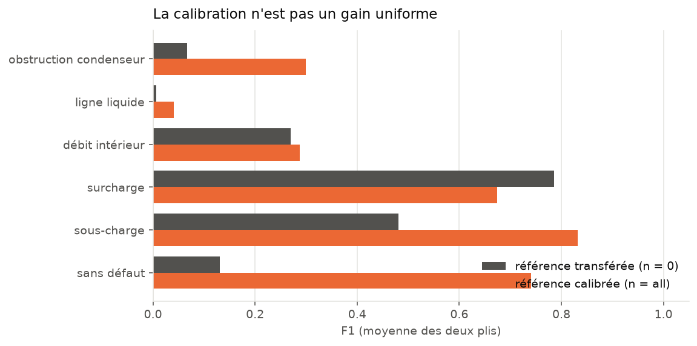

| Fault | Without calibration | With calibration | Gap |
|---|---|---|---|
| No fault | 0.131 | 0.741 | **+0.610** |
| Undercharge | 0.481 | 0.832 | +0.351 |
| Condenser blockage | 0.067 | 0.299 | +0.232 |
| Liquid line | 0.007 | 0.040 | +0.034 |
| Indoor airflow | 0.269 | 0.288 | +0.018 |
| **Overcharge** | **0.786** | 0.674 | **−0.111** |

Two lessons.

**Calibration first serves to recognise the healthy state**: +0.61 on that class alone.
That is consistent — without a correct reference, the model judges everything abnormal. On
one machine, it says "no fault" in only 2% of cases.

**And overcharge is detected better without calibration than with it**: 0.786 on a
completely unknown machine, consistent in both transfer directions. Its signature —
subcooling taking off — is marked enough to do without a local reference.

The calibration budget is therefore not a single number. **It depends on the fault being
sought, and for one of them it is zero.**

> **For the jury.** This is where the project becomes usable. Not because the figures are
> good, but because they are detailed enough to tell a practitioner what they can count
> on: charge faults, on a machine never seen, one of them with no prior installation.

# 12. Is learning even necessary?

Residual diagnosis is a field whose reference method is a **sign table**: if subcooling
rises and high-side pressure rises, it is a condenser blockage. This project takes the
residuals of that method, then puts a learned model on top. The question follows: **does
the learned model add anything?**

## The comparison, at the same protocol

Three candidates, same validation by machine, same measured tests:

| Method | accuracy | F1 macro |
|---|---|---|
| **Gradient boosting, calibrated reference** | **0.602** | **0.479** |
| Decision tree of depth 3 | 0.558 | 0.422 |
| Rule table, calibrated reference | 0.365 | 0.243 |
| Gradient boosting, transferred reference | 0.318 | 0.290 |
| Rule table, with no reference at all | 0.245 | 0.197 |

*(majority class: 0.251)*

**Learning wins by 24 points over the rule table.** Six thermodynamic rules are not
enough, and that is no longer a postulate but a measurement.

## But the complexity is not justified

A decision tree of **depth 3** scores 0.558 against 0.602 — four and a half points of gap,
for a model that fits on a page and reads like thermodynamics:

```
d_subcooling <= -1.24
  ├─ d_W_od <= 83.6   → undercharge
  └─ d_W_od >  83.6   → condenser blockage
d_subcooling >  -1.24
  ├─ d_P_cond <= 0.23                        → no fault
  ├─ d_P_cond <= 1.43                        → indoor airflow
  └─ d_P_cond >  1.43 ─ d_subcooling <= 4.52 → condenser blockage
                     └ d_subcooling >  4.52  → overcharge
```

Subcooling falling: undercharge. Rising with high-side pressure: overcharge. That is
exactly the physics of section 1, recovered by learning.

**And this tree beats the ensemble on undercharge** — 0.905 against 0.832, the
best-detected fault in the set. An ensemble of hundreds of trees buys four points over a
model a technician can check line by line.

## Two results of detail

**The rules win in one place**: liquid-line restriction, 0.136 against 0.040. Three times
better than the learned model on the fault it never finds. Both stay poor in absolute
terms, but that is the kind of gap a mean hides.

**And a hypothesis fell.** The hope was that a rule table, looking at directions and not
values, could diagnose **with no calibration at all** — which would have given a tool
deployable on an unknown machine with no prior installation. Measured: **0.245**, below
the majority class. Without a local reference, the signs alone do not carry the
information.

> **For the jury.** The question "does your model beat a hand-written rule?" has a
> numbered answer: yes, by 24 points. The next question — "do you need all this
> complexity?" — has a less flattering answer: a depth-3 tree recovers 93% of it. For a
> field deployment, that is probably the right deliverable.

# 13. What the 0.602 actually assumes

The previous sections announce 0.602 when the healthy reference is calibrated on the
target machine. A benchmark of the reference estimator measured what that figure assumes —
and the answer limits its scope.

## The test campaign is replicated by construction

**28% of faulty tests have a healthy test within 0.1 °C**, and 72% within 0.5 °C. That
is logical for a controlled campaign: the laboratory tests the same nominal conditions
with and without the fault. On a machine in service, where the recorded healthy
measurements are the ones that happened to occur, that twin does not exist.

## What happens when the twin is forbidden

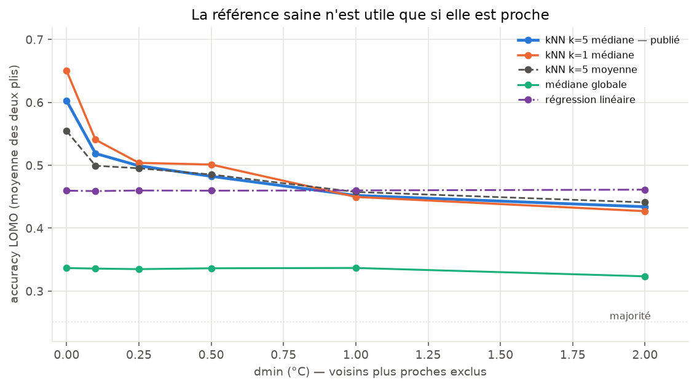

Forbidding neighbours closer than `dmin` to the condition being diagnosed:

| `dmin` | accuracy |
|---|---|
| 0 — published protocol | **0.602** |
| 0.1 °C | 0.519 |
| 0.25 °C | 0.499 |
| 0.5 °C | **0.482** |
| 1.0 °C | 0.452 |
| 2.0 °C | 0.434 |

**Excluding neighbours at 0.1 °C is enough to lose eight points.** The drop is immediate,
which means the figure rests on nearly exact twins rather than on an estimate.

## Three lessons from the benchmark

**The fitted surfaces are flat.** Linear regression, order-2 polynomial, Ridge: about 0.46
whatever `dmin`. They never used the twins — and they never reach 0.602. On the chart, the
horizontal line is the one every neighbourhood estimator converges to once the replicates
are excluded.

**The median is worth 4.8 points.** The project's implementation takes the median of the
five neighbours; the mean, the library default, gives 0.554. An implementation detail
carries a real share of the result.

**And above all, the gain is not where it was thought to be.** By class, at
`dmin = 0.5 °C`:

| Class | F1 at `dmin=0` | F1 at `dmin=0.5` |
|---|---|---|
| No fault | 0.735 | **0.434** |
| Undercharge | 0.854 | 0.841 |

The twelve accuracy points lost come almost entirely from recognising the **healthy**
state. Diagnosis of the charge faults survives without a twin. The advantage of the
replicates was not naming the faults: it was recognising the machine when healthy.

## The verdict

The 0.602 **holds as a climate-chamber protocol figure** — a healthy test exists at the
same condition, which is a property of the experimental plan. It **does not hold** as the
performance expected on a machine in service, where the realistic value sits between
**0.43 and 0.52** depending on the density of available healthy measurements.

> **For the jury.** This is the third time in this document that a figure changes meaning
> according to a protocol detail: the random split against the split by machine, the
> origin of the healthy reference, and now the structure of the test plan. This is not an
> accumulation of bad luck — it is the demonstration that the protocol, not the model, is
> what carries the result.

# 14. Does the figure survive outside the learned conditions?

The simulated side is validated by a **random** hold-out: the examples are shuffled, 30%
set aside. But the conditions are drawn uniformly in a continuous, densely sampled domain
— a test point therefore almost always has a very close training neighbour.

The same suspicion as on the measured side, applied to the simulated side: **does the
model recognise a fault, or an operating point?**

*(Measurements made on the six-class configuration, before overcharge was added.)*

## In operating conditions: it survives

| Split | accuracy |
|---|---|
| Random control | 0.919 |
| `speed_ratio > 0.85` held out | 0.920 |
| `GroupKFold` on condition bins | 0.911 |
| `T_ambient < −5 °C` held out | 0.893 |
| `T_setpoint > 48 °C` held out | 0.889 |

**Three points of loss at worst**, on an entire region of the domain never seen. That is a
positive result, and it was not a given: the opposite hypothesis was the one expected.

## In severity: it collapses

Two of the six classes — the fan faults — have **no example** below a severity of 0.20:
the generator never produces a slightly degraded fan. The analysis is therefore restricted
to the four classes present on both sides.

| Task | Emerging faults | Marked faults |
|---|---|---|
| **Diagnosis** — name the fault, 4 classes | **0.428** | 0.469 |
| **Detection** — say there is a problem | **0.887** | 0.762 |

The distinction is clean and useful: **the system can say there is a problem in a severity
regime never seen, but not which one.**

One detail is worth keeping: on undercharge, training on the mild cases and testing on the
severe ones gives 307 correct identifications out of 307. **Learning an emerging
undercharge helps recognise an advanced undercharge**; the reverse is less true.

> **For the jury.** The simulated-side figure is not an early-detection score. It measures
> separability of the signatures at median severity. An operator who wants to catch a
> fault before it costs money should read the "detection" row, not the "diagnosis" row.

# 15. Does the simulator describe reality?

The whole first half of this document rests on a simulator. The whole second half on
measured tests. **They had never been confronted**: train on one, test on the other.

That is possible because the 5.3% domain overlap mentioned above is a **sampling-choice**
obstacle, not a physics one. Drawing the simulated conditions inside the NIST domain makes
the comparison direct.

Scope: five classes that correspond, and indoor temperatures below 26 °C — beyond that,
the simulator clips its evaporation temperature at 20 °C and would produce distorted
cycles. That leaves 59% of the measured tests.

## Three comparable protocols

| | accuracy | F1 macro |
|---|---|---|
| Simulated → simulated, hold-out | **0.921** | 0.917 |
| Measured → measured, by machine | **0.668** | 0.596 |
| **Simulated → measured** | **0.454** | 0.343 |

*(majority class: 0.281)*

The second protocol is indispensable: without it, one would not know whether a score of
0.454 means the simulator is bad, or that the task is simply hard. **It reads between
0.281 and 0.668** — the simulator transfers partially.

## But the mean hides the essential

| Class | F1, simulated → measured |
|---|---|
| No fault | 0.716 |
| Overcharge | 0.522 |
| Undercharge | 0.445 |
| **Evaporator airflow** | **0.031** |
| **Condenser fouling** | **0.000** |

**The simulator transfers on refrigerant charge and fails completely on the exchangers.**
Zero on condenser fouling — not "weak", zero.

And this result lines up with everything else. The confrontation of the signs of variation
(section 1) had shown that fouling subcooling and fan-fault superheat were **of reversed
sign**, and they were corrected. Correcting the sign was clearly not enough to make the
amplitude transferable.

The story is consistent from one end of the project to the other: **the physics of
refrigerant charge is right, the physics of the exchangers is not.**

> **For the jury.** This is the only measurement in the project that says what its own
> simulator is worth. It is harsh and it is precise: the simulator serves to demonstrate
> and to explore, and it serves to train a field model **for charge faults only**. A
> project that knows that about its tool knows more than most.

# 16. Conclusion

## What the system does

It models a complete thermodynamic cycle and derives consistent fault signatures from it;
it builds a training set from them; it diagnoses seven classes; it serves the whole thing
through an API and a dashboard that clone and run with no preparation.

And above all, it has been **confronted with independent measurements** — which produced
four physics corrections, the closing of four pipeline leaks, and five results that no
simulation alone could have given.

## What it knows about itself

This is the unusual part, and it is the part that matters.

| Question | Measured answer |
|---|---|
| What is the announced figure worth? | 89.3% on simulated data, hold-out, selection on validation |
| Does it survive outside the learned conditions? | **Yes** — 0.889 at worst |
| Does it survive emerging faults? | **No** for diagnosis (0.43), **yes** for detection (0.89) |
| Which faults are detected on real data? | Charge faults; neither airflow faults nor the liquid line |
| What does deployment cost? | A healthy calibration on the machine, **close** to the conditions to diagnose |
| Is learning justified? | **Yes**, +24 points over a rule table — but a depth-3 tree recovers 93% |
| Does the simulator describe reality? | **On charge yes** (F1 0.45–0.52), **on the exchangers no** (0.00–0.03) |

## The thread

Six times in this document, a figure changed meaning according to a protocol detail: the
random split against the split by machine, the origin of the healthy reference, the
structure of the test plan, the severity regime, the presence of a label leak, the
training set itself.

This is not an accumulation of bad luck. **It is the demonstration that the protocol, not
the model, is what carries the result.** The displayed figure went from 99.8% to 89.3%
over these corrections, and each drop made the project truer.

## What it does not do

- It does not detect faults at 99% in the field.
- It does not work on an unknown machine without a prior calibration, and a close one.
- It does not diagnose emerging faults. It only flags them.
- It does not predict future faults: the available tests are stationary, with no time
  axis. Inventing one would produce exactly the kind of figure this work is built not to
  produce.

## The defensible formulation

> Fault signatures are separable at 89.3% in hold-out on simulated data at median
> severity, and that figure survives extrapolation in operating conditions. Confronted
> with independent measured tests, the system diagnoses charge faults — on a real machine
> never seen, overcharge is even identified with no calibration at all — and separates
> neither airflow faults nor liquid-line restriction.
>
> The simulator, for its part, transfers on refrigerant charge and not on the exchangers.
> It serves to demonstrate and to explore; it does not serve to train a field model,
> except on charge.

# Appendices

The previous parts tell the system. These make it possible to check it. Every equation is
transcribed from `src/physics/simulator.py`, without reformulation.

## A. Symbols

| Symbol | Quantity | Unit | Nominal |
|---|---|---|---|
| $T_{source}$ | Cold-source temperature | °C | 7 |
| $T_{sink}$ | Hot-sink temperature | °C | 40 |
| $n$ | Compressor speed relative to nominal | — | 0.3 to 1.0 |
| $\varphi_{evap},\ \varphi_{cond}$ | Fouling (0 = clean, 1 = blocked) | — | 0 |
| $r_{evap},\ r_{cond}$ | Airflow relative to nominal | — | 1.0 |
| $c$ | Refrigerant charge relative to nominal | — | 1.0 |
| $UA$ | Overall heat-transfer coefficient | W/K | 500 / 600 |
| $\tau$ | Pressure ratio | — | about 3 |
| $k$ | Specific-heat ratio of R-410A | — | — |
| $SH,\ SC$ | Superheat, subcooling | K | 6.0 and 4.5 |

The six parameters $\varphi$, $r$ and $c$ are the **fault inputs**. At their nominal
values, the cycle is healthy.

## B. The thermodynamic model

### B.1 Heat exchangers

$$UA_{evap} = 500\,\bigl(1 - 0.50\,\varphi_{evap}\bigr)\,r_{evap}^{\,1.45}
\qquad
UA_{cond} = 600\,\bigl(1 - 0.50\,\varphi_{cond}\bigr)\,r_{cond}^{\,1.45}$$

$$\Delta_{evap} = 5 + 7\left(1 - \frac{UA_{evap}}{500}\right)
\qquad
\Delta_{cond} = 5 + 7\left(1 - \frac{UA_{cond}}{600}\right) + 8\,(1 - r_{cond})$$

$$T_{evap} = \mathrm{clamp}\bigl(T_{source} - \Delta_{evap},\; -25,\; 20\bigr)
\qquad
T_{cond} = \mathrm{clamp}\bigl(T_{sink} + \Delta_{cond},\; 20,\; 65\bigr)$$

The symmetric term $8\,(1 - r_{evap})$ on the evaporator side was **removed**: it made
discharge temperature rise with the loss of flow, against the measured direction.

### B.2 Pressures and pressure ratio

$$P_{evap} = P_{sat}(T_{evap}) \qquad P_{cond} = P_{sat}(T_{cond})$$

Charge faults act on these pressures, then the saturation temperatures are recomputed so
they stay consistent:

$$c < 1 : \quad P_{evap} \leftarrow P_{evap}\,(0.55 + 0.45\,c), \qquad T_{evap} \leftarrow T_{sat}(P_{evap})$$

$$c > 1 : \quad P_{cond} \leftarrow P_{cond}\,\bigl(1 + 0.90\,(c-1)\bigr), \qquad T_{cond} \leftarrow T_{sat}(P_{cond})$$

$$\tau = \frac{P_{cond}}{\max(P_{evap},\ 0.5)}$$

An undercharge starves the evaporator and collapses the low-side pressure; an overcharge
floods the condenser and raises the high-side pressure. Both widen $\tau$, but **from
opposite ends of the cycle** — hence distinct signatures.

### B.3 Compressor efficiencies

$$\eta_{is} = 0.75\,f(\tau)\,g(n), \qquad
f(\tau) = \mathrm{clamp}\bigl(1 - 0.05(\tau-3)^2,\,0.4,\,1\bigr), \qquad
g(n) = 1 - 0.30\,(n-0.7)^2$$

$$\eta_{vol} = 1 - C\left(\tau^{1/k} - 1\right), \qquad C = 0.05$$

$C$ is the clearance-volume ratio. Isentropic efficiency is maximum around $\tau = 3$ and
falls on either side.

### B.4 Superheat and subcooling

$$SH = 6.0\,\bigl(1 + 0.85\,\varphi_{evap}\bigr)\bigl(1 - 0.20\,(1 - r_{evap})\bigr)$$

$$SC = 4.5\,\bigl(1 + 0.65\,\varphi_{cond}\bigr)\bigl(1 - 0.12\,(1 - r_{cond})\bigr)$$

then, depending on charge:

$$c < 1 : \quad SH \leftarrow SH\,\bigl(1 + 1.4\,(1-c)\bigr), \qquad SC \leftarrow SC\,\max(c,\,0.25)$$

$$c > 1 : \quad SH \leftarrow SH\,\max\bigl(1 - 1.4\,(c-1),\,0.25\bigr), \qquad SC \leftarrow SC\,\bigl(1 + 2.2\,(c-1)\bigr)$$

$$SC \leftarrow \max(SC,\ 0.4)$$

Physical reading of each term:

| Term | Effect | Why |
|---|---|---|
| $+0.85\,\varphi_{evap}$ on $SH$ | Evaporator fouling: superheat **rises** | The two-phase zone lengthens |
| $-0.20\,(1-r_{evap})$ on $SH$ | Less air: superheat **falls** | Less heat absorbed at the end of the evaporator |
| $+0.65\,\varphi_{cond}$ on $SC$ | Condenser blockage: $SC$ **rises** | Liquid accumulates because heat cannot leave |
| $-0.12\,(1-r_{cond})$ on $SC$ | Condenser fan: weak effect | The fault mainly raises $T_{cond}$ |
| $\max(c,\,0.25)$ on $SC$ | Undercharge: $SC$ **collapses** | Not enough liquid left to subcool |
| $+2.2\,(c-1)$ on $SC$ | Overcharge: the strongest effect in the model | The excess liquid piles up |

The terms called out above are the ones **corrected after confrontation with the
measurements**. The initial model had them reversed, or absent.

### B.5 Compressor bounds

$$T_{suc} = T_{evap} + SH$$

$$T_{dis}^{\,ideal} = \bigl(T_{suc} + 273.15\bigr)\,\tau^{\frac{k-1}{k}} - 273.15$$

$$T_{dis} = T_{suc} + \frac{T_{dis}^{\,ideal} - T_{suc}}{\eta_{is}}
            + 10\,(1 - r_{cond}) - 25\,(1 - r_{evap})$$

$$T_{dis} \leftarrow \min\bigl(T_{dis},\ 130\bigr)$$

The two corrective terms are **calibrated on the measured tests**, not derived: loss of
flow at the condenser heats the discharge, loss at the evaporator cools the suction. They
are stated as fitted parameters.

The 130 °C ceiling is the manufacturer's envelope. It was declared without ever being
applied.

### B.6 Mass flow, enthalpies, powers

$$\dot m = V_{sw}\,f_{nom}\,n\,\rho_{suc}\,\eta_{vol}
\times \begin{cases}
0.55 + 0.45\,c & c < 1\\[2pt]
1 + 0.25\,(c-1) & c > 1\\[2pt]
0.75 + 0.25\,r_{evap} & r_{evap} < 1
\end{cases}$$

$$h_1 = h_{vap}^{sat}(T_{evap}) + c_{p,vap}\,SH
\qquad
h_3 = h_{liq}^{sat}(T_{cond}) - 1.5\,SC
\qquad
h_4 = h_3$$

$$\Delta h_{ideal} = c_{p,vap}\bigl(T_{dis}^{\,ideal} - T_{suc}\bigr)
\qquad
\Delta h_{real} = \frac{\Delta h_{ideal}}{\eta_{is}}
\qquad
h_2 = h_1 + \Delta h_{real}$$

$$Q_{evap} = \dot m\,(h_1 - h_4)
\qquad
Q_{cond} = \dot m\,(h_2 - h_3)
\qquad
W_{comp} = 1.10\,\dot m\,\Delta h_{real}
\qquad
COP = \frac{Q_{cond}}{W_{comp}}$$

The factor 1.10 covers mechanical and electrical losses. The expansion $h_4 = h_3$ is
assumed isenthalpic, the standard assumption for an expansion device.

### B.7 Measurement noise

Gaussian noise: $\pm 0.5$ °C on temperatures, 2% on pressures, 3% on powers. It is
applied to the sensors, **then** the derived quantities are recomputed, and the healthy
reference of the `d_*` is noised independently.

| Derived quantity | Rows consistent with its inputs |
|---|---|
| `pressure_ratio`, `compression_ratio` | 100% |
| `COP` | 100% |
| `delta_T_evap`, `delta_T_cond` | 100% |

Before that correction, `d_COP` was exactly zero for the 2000 healthy tests and for them
alone. Three other leaks (scaling before the CV, CV on the full set, selection on the
test) are closed by a sklearn `Pipeline`, a CV on the train set, and a train / val / test
split. Guards in `tests/test_pipeline_integrity.py`.

## C. Validation methods

### C.1 The residual

$$\tilde{x} = x_{observed} - \hat{x}_{healthy}\bigl(T_{source},\,T_{sink},\,n\bigr)$$

Five residuals enter the vector: `d_T_discharge`, `d_superheat`, `d_subcooling`, `d_COP`,
`d_W_comp`. The decisive question is the origin of $\hat{x}_{healthy}$:

| Origin | What it assumes | Score |
|---|---|---|
| Simulated | The physical model is exact | not measurable on real data |
| Healthy tests of the target machine | The machine was observed healthy | 0.602 |
| Healthy tests of another machine | Nothing | 0.318 |

### C.2 The healthy-reference model

$$\hat{x}_{healthy}(T_{source}, T_{sink}) = \mathrm{med}\Bigl\{x_i \;:\; i \in \mathcal{V}_k\Bigr\},
\qquad k = \min(5,\,n)$$

where $\mathcal{V}_k$ denotes the $k$ healthy tests closest in the
$(T_{source}, T_{sink})$ plane. Richer forms do not improve transfer: order-2 polynomial
with dew point 0.302; random forest 0.265; against 0.318 for the nearest neighbour.
**The ceiling is not a limit of the reference model. It is a limit of transfer between
machines.**

### C.3 The two protocols

| Protocol | What it lets the model learn | Score |
|---|---|---|
| Random CV | The fault **and** the identity of the machine | 0.95 |
| Leave-one-machine-out | The fault alone | 0.60 |

### C.4 Agreement of the signs of variation

$$x = \beta_0 + \beta_1\,L + \beta_2\,T_{source} + \beta_3\,T_{sink}$$

$L$ is the fault level; $\beta_2$ and $\beta_3$ neutralise the test conditions. The
measured $\mathrm{sign}(\beta_1)$ is compared with the sign of the simulated slope. An
indicator insensitive to the domain shift, since it compares only directions.

Score before correction: 12 out of 16. After: **20 out of 22**.

### C.5 The calibration budget

Leave-one-machine-out in both directions; reference built on $n$ healthy tests of the
machine under test, **removed from the test set**; twenty draws per value of $n$.

Protocol controls: $n = 0 \rightarrow 0.318$ and $n = \text{all} \rightarrow 0.602$,
recovered exactly.

## D. Reproducing the figures

| Figure | Where |
|---|---|
| 89.3% [87.6 – 90.7] simulated | `main_analysis.py`, `outputs/results.csv` (X0 / holdout-test) |
| 0.95 / 0.602 / 0.318 | `EDA/EDA_NIST_model.ipynb`, `EDA/EDA_NIST_reference.ipynb` |
| Sign agreement 20/22 | `EDA/EDA_NIST_model.ipynb` |
| Calibration budget | `EDA/EDA_NIST_calibration.ipynb` |

The NIST workbooks are not versioned. Download addresses and the correspondence table for
the 98 columns are in `docs/NIST_MAPPING.md`.

