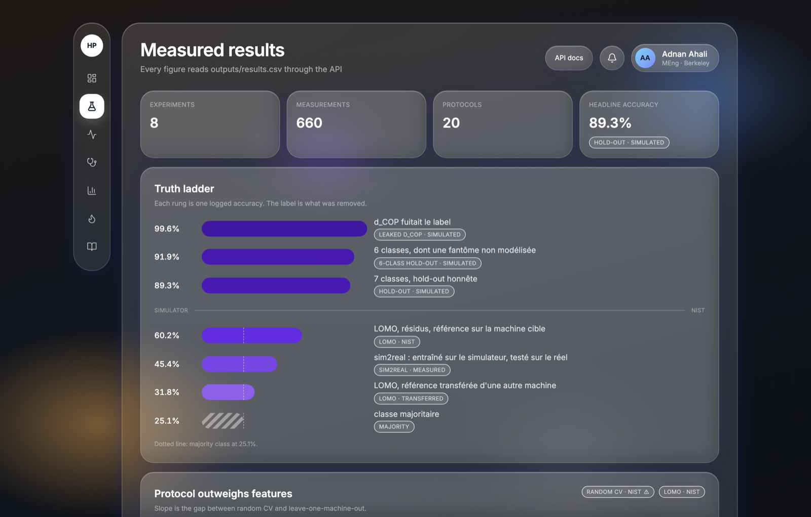
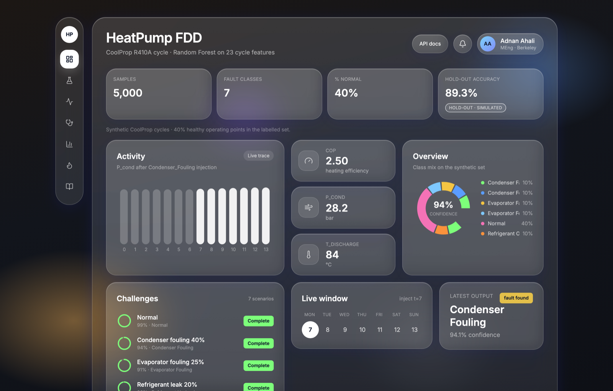
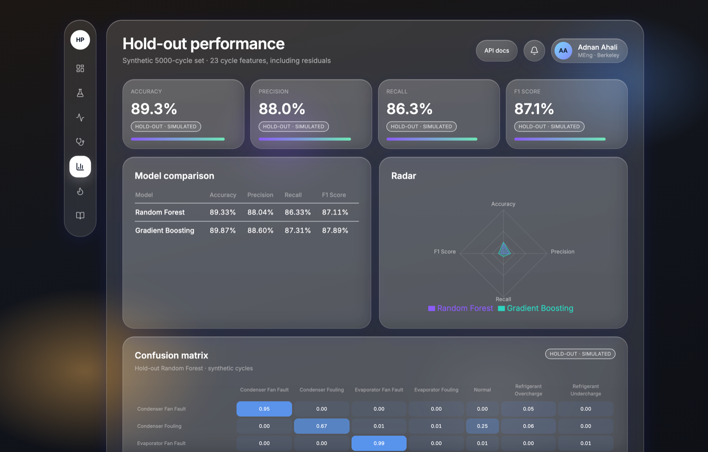
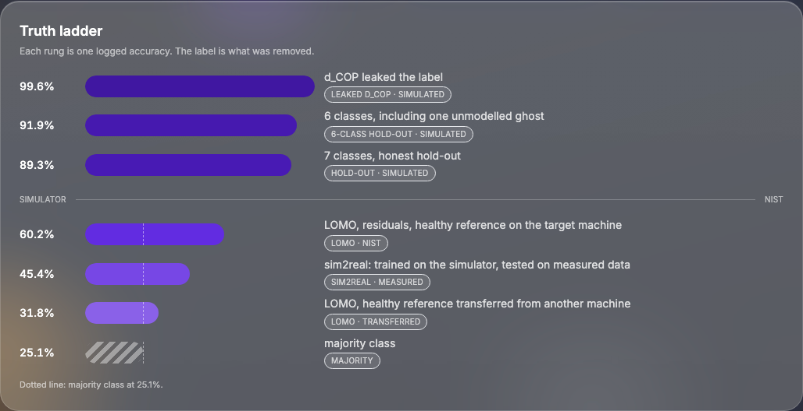
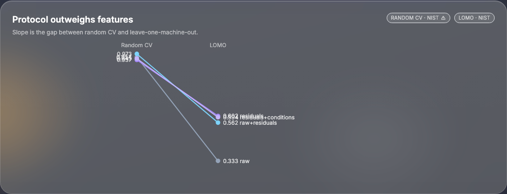
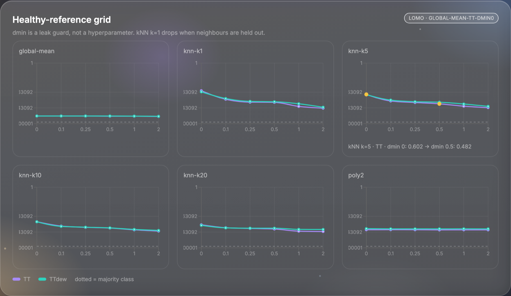
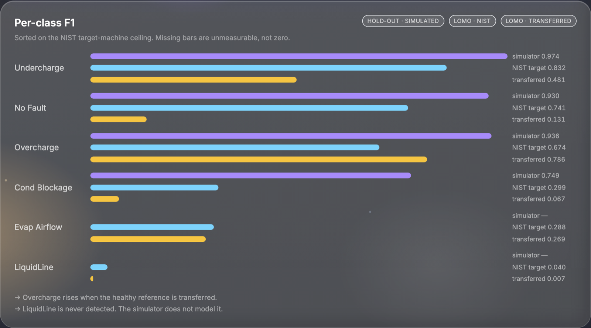
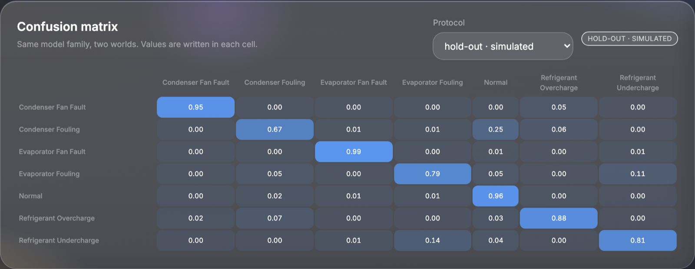
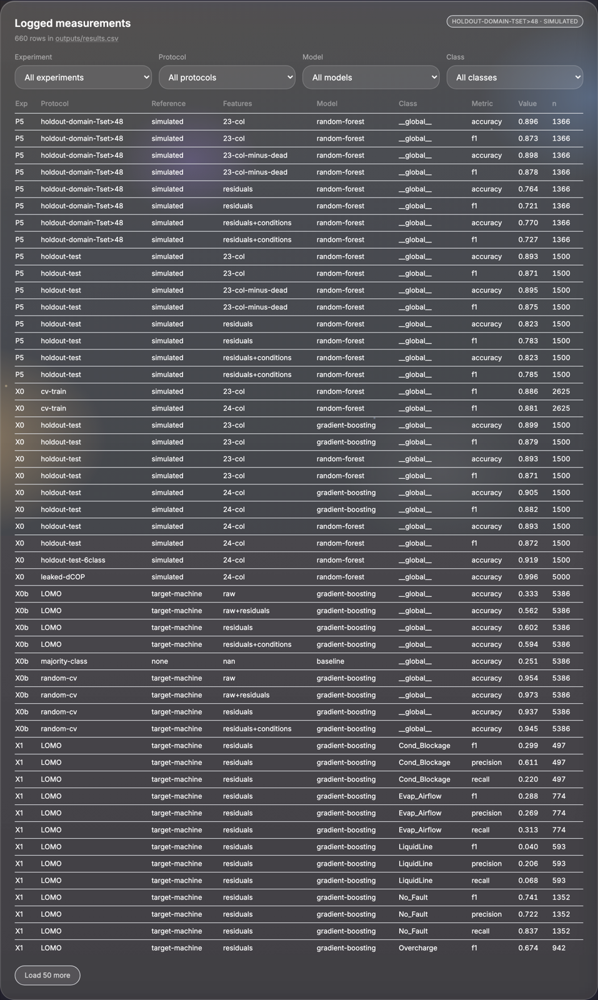

# 0. Le problème et la contrainte fondatrice

Le tableau de bord `web/` savait **appeler** un modèle. Il simule un point de
fonctionnement, affiche des probabilités, trace un diagramme $P$-$h$. Il est joli.
Il tourne.

Il ne montrait **rien** de ce que le dépôt a réellement établi. Les mesures de
`outputs/results.csv`, les expériences X0→X5, le fait qu'un protocole honnête
divise la performance par trois — tout cela n'existait que dans le README et
dans [DOSSIER.md](DOSSIER.md).

Un jury qui ouvre le front voyait un projet de démo. Un jury qui lit le dossier
voyait un projet de recherche. C'est le même dépôt. P7 est le rattrapage :
**le front doit afficher ce qu'on a mesuré**, y compris le chiffre qui dérange.

Ce document raconte ce qui a été livré, avec les captures du nouveau front.

## Comment lire ce document

Comme le dossier technique, chaque étape répond à trois questions :

| | |
|---|---|
| **Physique** | Quel phénomène (fuite de label, transfert de machine, fuite $k$NN) la figure rend visible |
| **Apprentissage** | Quelle décision de protocole le chiffre engage |
| **Ingénierie** | Pourquoi le chiffre ne vit pas dans le TSX |

## Ce qui a changé dans le dépôt

```
api/
+-- routers/evidence.py      GET /api/evidence/* — pandas, pas le joblib
+-- schemas/evidence.py      contrats Pydantic
+-- deps.py                  get_results() + cache mtime
+-- settings.py              results_path → outputs/results.csv

web/src/
+-- pages/EvidencePage.tsx
+-- components/ProtocolBadge.tsx
+-- components/ErrorBoundary.tsx
+-- components/evidence/     TruthLadder, ProtocolSlope, ReferenceBenchmark,
|                            PerClassBars, ConfusionPanel, RunsTable
+-- App.tsx                  react-router : /evidence, /models, …

tests/test_evidence.py       CSV jouet, sans classifier.joblib
web/e2e/evidence.spec.ts     Playwright : six figures, pas de NaN
```

La règle d'import ne change pas. Evidence **n'importe pas** `FDDEngine`. Une
page de résultats qui exigerait le classifieur pour s'afficher dirait le
contraire de ce qu'elle raconte.

# 1. Le principe — zéro chiffre en dur

**Apprentissage.** Un nombre sans protocole n'est pas un résultat. C'est la
leçon de X0b, mesurée : CV aléatoire 0,937 contre leave-one-machine-out 0,602
sur les mêmes résidus (`X0b` / `residuals` / `gradient-boosting`,
`outputs/results.csv`). Le front héritait du même piège que le README avant
P5 : recopier « 89,3 % » dans un composant, c'est figer une capture d'écran.

**Ingénierie.** `tools/results.py` est déjà la source unique côté Python.
Le garde `test_readme_results_percentages_are_logged` interdit au README
d'afficher un pourcentage qui n'est pas journalisé. P7 étend la règle au
TSX : **aucune valeur `xx.x %` n'est écrite dans** `web/src/**/*.tsx`.
Tout circule :

```
outputs/results.csv  →  GET /api/evidence/*  →  composant React
```

Rejouer une expérience et appeler `tools.results.log()` met le dashboard à
jour tout seul. Un test CI, `test_web_tsx_has_no_hardcoded_result_percentages`,
garde la règle.

Le tableau « coût de la calibration » du README (0 / 10 / 50 essais sains)
n'avait **pas** de lignes dans le CSV — le garde ne voyait que les pourcentages
suivis d'un `%`. Les décimaux nus 0,377 et 0,456 sont maintenant journalisés
(`X1` / `LOMO-calibration-n10` et `n50`). **Il n'y a toujours pas de courbe
de calibration dans le front** : le plan l'interdit tant que le principe
n'admet aucune exception. Journaliser n'autorise pas à redessiner.

# 2. L'architecture — ce qui circule

## Backend — `GET /api/evidence/*`

Nouveau routeur `api/routers/evidence.py`, schémas dans
`api/schemas/evidence.py`, dépendance `get_results()` dans `api/deps.py`
(lecture CSV + cache mtime, le motif de `get_dataset`).

| Endpoint | Rend | Figure |
|---|---|---|
| `/api/evidence/summary` | 8 expériences, 660 mesures, 20 protocoles, headline 89,3 % et son protocole | bandeau |
| `/api/evidence/ladder` | l'échelle de vérité, chaque barre portant sa cause | 1 |
| `/api/evidence/protocols` | X0b : 4 jeux de grandeurs × 2 protocoles | 2 |
| `/api/evidence/references` | X3 : grille famille × conditionnement × $d_{\min}$ | 3 |
| `/api/evidence/per-class` | F1 par classe, trois régimes, classes alignées **côté serveur** | 4 |
| `/api/evidence/confusion` | matrice hold-out (sim2real : 404 tant que l'artefact n'existe pas) | 5 |
| `/api/evidence/runs` | les 660 lignes, filtrables, 50 par page | 6 |

Les routes sont des `def` : pandas est bloquant, FastAPI les pousse dans le
threadpool. Pas d'`async` cosmétique. CSV absent → `ArtifactMissing` → 404,
jamais une 500. Un test tourne sur un CSV jouet écrit dans `tmp_path`, via
`create_app(Settings(results_path=...))`, **sans** le joblib livré.

La correspondance des classes vit dans `_CLASS_ALIGN` de
`api/routers/evidence.py`, pas dans le TSX. Le simulateur parle
`Refrigerant_Overcharge` ; NIST parle `Overcharge`. Un zéro côté simulateur
pour `LiquidLine` dirait « mesuré et nul ». Un trou dit « pas mesurable ».
Le serveur envoie `null`. Le front dessine un emplacement vide.

## Front — la page Evidence

Septième item de sidebar, icône fiole, **deuxième position** — juste après
Insights. Route partageable : `/evidence`.

Style : le verre existant. `GlassCard`, `tooltipStyle`, `recharts`, bordures
`rgba(255,255,255,0.18)`. Pas de second langage visuel pour la moitié
sérieuse de l'application.



Le bandeau affiche ce que le journal contient **aujourd'hui** : 8 expériences,
660 mesures, 20 protocoles, accuracy headline **89,3 %** avec la puce
`hold-out · simulated`. Ces quatre nombres ne sont pas dans le TSX.

### `ProtocolBadge` — le composant qui change tout

Une puce de verre, posée sur **chaque chiffre d'Evidence**, et sur le 89,3 %
d'Insights et de Models :

```
[ hold-out · simulated ]   [ LOMO · NIST ]   [ random CV ⚠ ]
```

Un jury qui voit 89,3 % sans savoir sur quoi ne peut rien en faire. La puce
répond avant qu'il pose la question. C'est X0b rendue visible.



Le sous-titre d'Insights ne dit plus « calibrated Gradient Boosting ». Il dit
**Random Forest**, le modèle livré. Models ne dit plus « 23 residual features » :
les 23 colonnes ne sont pas toutes des résidus. `Refrigerant_Overcharge` a
enfin une couleur propre dans `FAULT_COLORS` — le collisionneur P4 est fermé.



# 3. Les six figures

## Figure 1 — L'échelle de vérité

C'est la figure la plus importante du dépôt. Barres horizontales, une seule
teinte (magnitude, pas identité), chacune annotée de **ce qu'on a retiré**
pour passer à la suivante.



| Marche | Accuracy | Protocole | Cause |
|---|---|---|---|
| 99,6 % | `X0` / leaked-dCOP / 24-col | simulé | `d_COP` fuitait le label |
| 91,9 % | `X0` / holdout-test-6class | simulé | 6 classes, dont une fantôme |
| 89,3 % | `X0` / holdout-test / 23-col / RF | simulé | 7 classes, hold-out honnête |
| — | filet | — | **frontière simulateur \| NIST** |
| 60,2 % | `X0b` / LOMO / residuals / GB | machine cible | résidus, référence sur la cible |
| 45,4 % | `X5` / sim2real / residuals / RF | mesuré | entraîné sur le simulateur |
| 31,8 % | `X1` / LOMO / training-machine | transféré | référence d'une autre machine |
| 25,1 % | `X0b` / majority-class | — | classe majoritaire |

Deux règles, non négociables, et tenues :

1. **Une séparation franche entre simulateur et NIST.** Ce ne sont pas les
   mêmes données. Une rampe continue laisserait croire à une dégradation unique.
2. **Une ligne pointillée à 25,1 %.** Sans elle, 31,8 % ressemble à un échec ;
   avec elle, on voit que c'est au-dessus du hasard, à peine.

**Physique.** La chute 99,6 → 89,3 n'est pas un modèle plus faible : c'est
`d_COP` qui **était** le label (`== 0` sur toutes les lignes saines, et sur
aucune autre classe). La chute 89,3 → 60,2 n'est pas non plus un estimateur :
c'est le passage d'un monde où le simulateur fabrique les questions **et**
les réponses, à deux machines de chambre climatique.

## Figure 2 — Le protocole pèse plus que le modèle

Slopegraph. Quatre jeux de grandeurs, deux colonnes (CV aléatoire, LOMO),
un trait par jeu. La donnée intéressante est la **pente**, pas les hauteurs.
Légende en bout de trait, pas de boîte.



| Grandeurs | CV aléatoire | LOMO |
|---|---|---|
| `raw+residuals` | 0,973 | 0,562 |
| `raw` | 0,954 | 0,333 |
| `residuals+conditions` | 0,945 | 0,594 |
| `residuals` | 0,937 | **0,602** |

L'écart de protocole (~0,4) écrase l'écart de features (~0,04). `residuals`
est le seul trait à peu près plat — et le seul à **monter** en LOMO. La puce
`random CV ⚠` est là pour ça : ce n'est pas un score utilisable en champ.

## Figure 3 — Le benchmark des références saines (X3)

C'est le jeu le plus riche du dépôt, et il n'était publié nulle part. X3
balaie une grille de modèles de référence sain : famille (`global-mean`,
$k$NN $k\in\{1,5,10,20\}$, `poly2`), conditionnement (`TT` ou `TTdew`),
$d_{\min} \in \{0; 0{,}1; 0{,}25; 0{,}5; 1; 2\}$ °C.

**Physique.** $d_{\min}$ n'est pas un hyperparamètre. C'est un garde-fou
contre la fuite. À $d_{\min}=0$, un essai en défaut peut avoir son jumeau
sain à 0,05 °C dans le jeu de référence — le $k$NN $k=1$ le retrouve et le
score explose. C'est l'artefact qui a failli être publié comme une
amélioration de +10 points.



Échelle Y identique sur toutes les facettes. Ligne pointillée à la classe
majoritaire. Annotation journalisée : `knn-k5-median-unif` / `TT` /
$d_{\min}=0$ donne 0,602 ; le même modèle à $d_{\min}=0{,}5$ donne 0,482.
**La pente est le diagnostic de fuite.**

## Figure 4 — Par classe, trois régimes

Trois séries, trois lignes de journal, classes alignées côté serveur, tri
sur le plafond NIST (référence machine cible).

| Série | Source | Ce que c'est |
|---|---|---|
| Simulateur | `X5` / holdout-test / simulated | le chiffre vitrine |
| NIST, cible | `X1` / LOMO / target-machine | le plafond réaliste |
| NIST, transféré | `X1` / LOMO / training-machine | machine réellement inconnue |



Deux faits, parce que c'est ce que la figure révèle :

- **Overcharge monte** quand la référence est transférée (0,674 → 0,786).
  Une surcharge se voit sans calibration : sa signature est absolue, pas
  relative à la machine. C'est le seul défaut déployable en l'état.
- **LiquidLine est à 0,040.** Jamais détecté. Le simulateur ne le modélise
  pas. On l'affiche quand même, avec un **trou** côté simulateur — pas un
  zéro.

## Figure 5 — Matrice de confusion

Heatmap, rampe séquentielle une teinte, 2 px entre les cellules, valeurs
écrites. Sélecteur de protocole au-dessus : hold-out simulé (artefact
`outputs/synthetic/confusion_matrix.csv`) ou sim2real. Tant que la matrice
sim2real n'est pas un CSV versionné, le sélecteur dit l'absence au lieu
d'inventer des zéros.



**Apprentissage.** Les ventilateurs restent séparés (0,95 / 0,99).
L'encrassage de condenseur perd 0,25 vers `Normal` — c'est la physique du
pincement, pas un bug d'estimateur. Le dossier le dit déjà ; le front le
montre.

## Figure 6 — Les 660 mesures

Table filtrable (expérience / protocole / modèle / classe), triable, colonne
$n$, 50 lignes, un bouton. C'est la pièce justificative : un jury sceptique
doit pouvoir descendre de n'importe quel graphe jusqu'à la ligne de CSV.



Le pied affiche `outputs/results.csv`. Modifier ce fichier et recharger
`/evidence` change le dashboard, sans toucher au TSX.

# 4. La dette front soldée dans la foulée

Ces points étaient identifiés avant P7 ; les traiter ici évite une quatrième
livraison orpheline.

| Point | Ce qui a été fait |
|---|---|
| Types dupliqués dans `api.ts` | `npm run gen:api` (`tools/export_openapi.py` + `openapi-typescript`), sortie versionnée `web/src/api.generated.ts` |
| Pas d'`AbortController` | chaque `useEffect` qui fetch annule au cleanup — Insights en lance plusieurs en parallèle |
| Pas d'`ErrorBoundary` | une frontière par route ; une exception de rendu ne vide plus l'écran |
| Navigation `useState` | `react-router-dom` : `/`, `/evidence`, `/live`, `/diagnose`, `/models`, `/thermo` |
| Pas d'ESLint | `eslint` + `typescript-eslint` + `react-hooks`, job CI `web` |
| Pas de test front | Playwright ouvre `/evidence`, attend les 6 figures, refuse `NaN` / `undefined` |

Le routeur conditionne le reste : sans URL, aucun graphe n'est envoyable à
un jury.

# 5. Ce que P7 ne prétend pas

- **Ce n'est pas un modèle de RUL.** Le classifieur nomme l'état présent.
  Le CSV iid n'a pas d'axe temporel de dégradation.
- **Ce n'est pas la courbe de budget de calibration.** Les 0,377 / 0,456
  sont journalisés pour le garde README ; ils n'ont pas de figure.
- **Ce n'est pas X3 en entier.** L'API sert toute la grille accuracy ; le
  front facette les familles que le plan nomme (`global-mean`, $k$NN
  $k=1/5/10/20$, `poly2`). `ridge`, `lin`, les agrégateurs $k$NN autres
  que `median-unif` restent dans la table §6.
- **La puce n'est pas encore sur chaque COP de Diagnose.** Elle est sur
  Evidence, et sur le 89,3 % d'Insights et de Models — là où un jury
  confondrait un hold-out simulé avec un champ.

# 6. Reproduire

```bash
.venv/bin/uvicorn api.app:app --reload          # http://127.0.0.1:8000/docs
cd web && npm run dev                           # http://localhost:5173/evidence
```

Evidence se charge **sans** `models/synthetic/classifier.joblib`. Les autres
pages (Diagnose, Live) en ont besoin.

```bash
.venv/bin/python -m pytest tests/test_evidence.py tests/test_docs.py -q
cd web && npm run lint && npm run build && npm run test:e2e
```

Les captures de ce document se régénèrent, API et Vite allumés, par
`web/scripts/capture_evidence.mjs`.

## Où vit chaque chiffre

| Chiffre | Ligne de `outputs/results.csv` |
|---|---|
| 89,3 % | `X0` / holdout-test / 23-col / random-forest / accuracy |
| 99,6 % | `X0` / leaked-dCOP |
| 91,9 % | `X0` / holdout-test-6class |
| 0,602 / 0,318 / 0,251 | `X0b` LOMO residuals, `X1` training-machine, majority-class |
| 0,454 | `X5` / sim2real / measured-knn5 |
| 0,937 vs 0,602 | `X0b` random-cv vs LOMO, residuals |
| Overcharge 0,674 → 0,786 | `X1` LOMO target- vs training-machine, label Overcharge, f1 |
| LiquidLine 0,040 | `X1` LOMO target-machine, label LiquidLine, f1 |
| kNN k=5 $d_{\min}$ 0 → 0,5 | `X3` / `knn-k5-median-unif-TT-dmin0` et `dmin0.5` |

Le dossier [DOSSIER.md](DOSSIER.md) raconte *pourquoi* ces protocoles existent.
Cette page raconte *comment* un jury les voit sans ouvrir un CSV.
