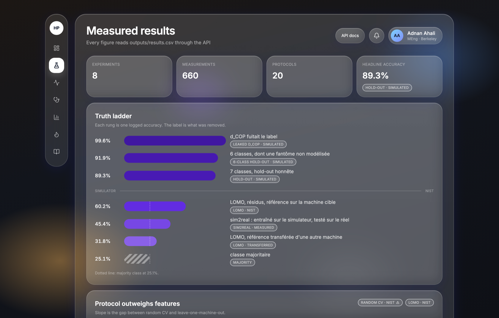
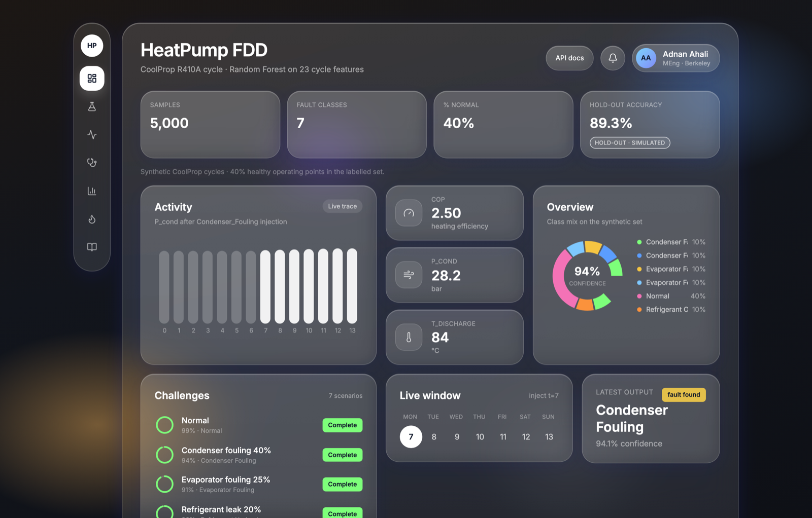
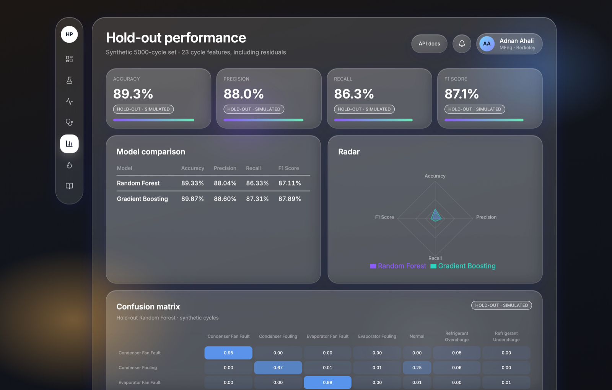
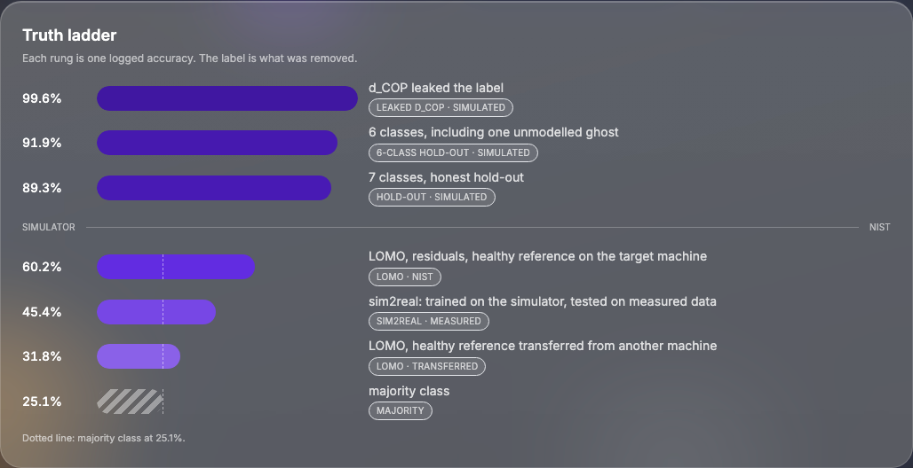
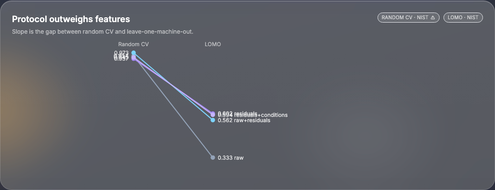
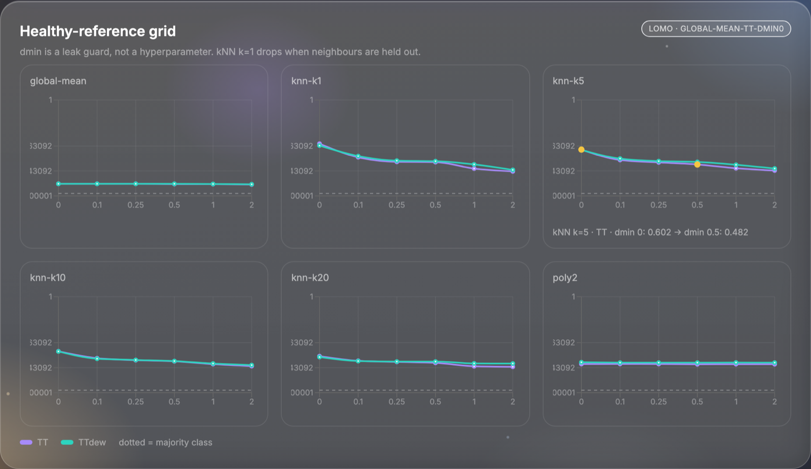
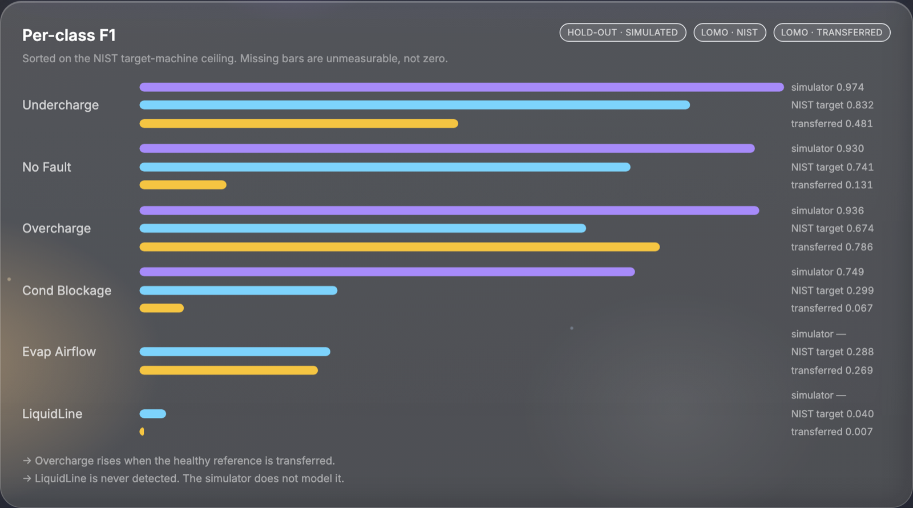
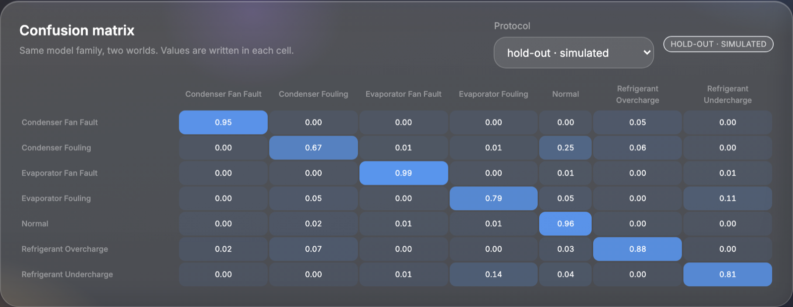
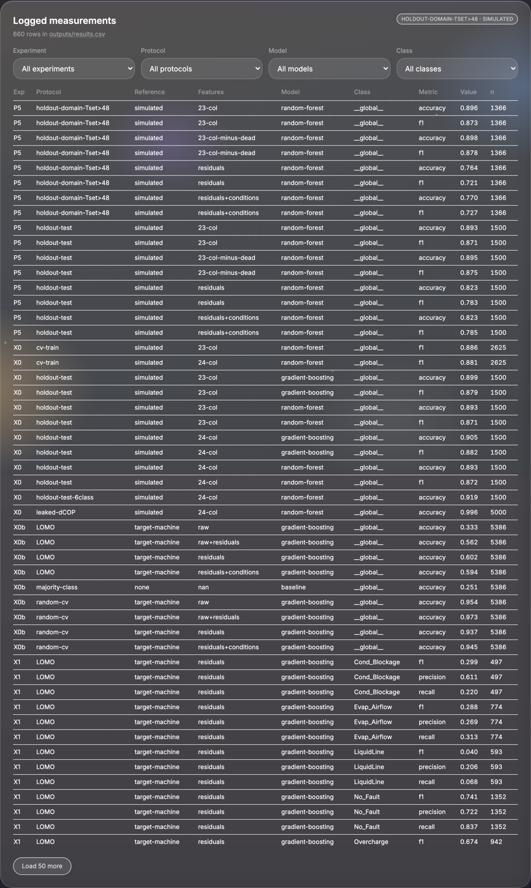

# 0. The problem and the founding constraint

The `web/` dashboard knew how to **call** a model. It simulates an operating point,
shows probabilities, draws a $P$-$h$ diagram. It looks good. It runs.

It showed **nothing** of what the repository has actually established. The measurements
in `outputs/results.csv`, experiments X0→X5, the fact that an honest protocol divides
performance by three — all of that existed only in the README and in
[DOSSIER.md](DOSSIER.md).

A jury that opened the front saw a demo project. A jury that read the dossier saw a
research project. It is the same repository. P7 is the catch-up: **the front must
display what was measured**, including the figure that is uncomfortable.

This document tells what was delivered, with captures of the new front.

## How to read this document

As in the technical dossier, each step answers three questions:

| | |
|---|---|
| **Physics** | Which phenomenon (label leak, machine transfer, $k$NN leak) the figure makes visible |
| **Learning** | Which protocol decision the figure commits to |
| **Engineering** | Why the figure does not live in the TSX |

## What changed in the repository

```
api/
+-- routers/evidence.py      GET /api/evidence/* — pandas, not the joblib
+-- schemas/evidence.py      Pydantic contracts
+-- deps.py                  get_results() + mtime cache
+-- settings.py              results_path → outputs/results.csv

web/src/
+-- pages/EvidencePage.tsx
+-- components/ProtocolBadge.tsx
+-- components/ErrorBoundary.tsx
+-- components/evidence/     TruthLadder, ProtocolSlope, ReferenceBenchmark,
|                            PerClassBars, ConfusionPanel, RunsTable
+-- App.tsx                  react-router: /evidence, /models, …

tests/test_evidence.py       toy CSV, without classifier.joblib
web/e2e/evidence.spec.ts     Playwright: six figures, no NaN
```

The import rule does not change. Evidence **does not import** `FDDEngine`. A results
page that required the classifier in order to render would say the opposite of what
it tells.

# 1. The principle — zero hardcoded figures

**Learning.** A number without a protocol is not a result. That is the lesson of X0b,
measured: random CV 0.937 against leave-one-machine-out 0.602 on the same residuals
(`X0b` / `residuals` / `gradient-boosting`, `outputs/results.csv`). The front inherited
the same trap as the README before P5: copying "89.3%" into a component freezes a
screenshot.

**Engineering.** `tools/results.py` is already the single source on the Python side.
The guard `test_readme_results_percentages_are_logged` forbids the README from showing
a percentage that is not logged. P7 extends the rule to TSX: **no `xx.x %` value is
written in** `web/src`. Everything flows:

```
outputs/results.csv  →  GET /api/evidence/*  →  React component
```

Replaying an experiment and calling `tools.results.log()` updates the dashboard on its
own. A CI test, `test_web_tsx_has_no_hardcoded_result_percentages`, keeps the rule.

The README "cost of calibration" table (0 / 10 / 50 healthy tests) had **no** rows in
the CSV — the guard only saw percentages followed by a `%`. The bare decimals 0.377
and 0.456 are now logged (`X1` / `LOMO-calibration-n10` and `n50`). **There is still
no calibration curve on the front**: the plan forbids it until the principle admits no
exception. Logging does not authorise redrawing.

# 2. The architecture — what flows

## Backend — `GET /api/evidence/*`

New router `api/routers/evidence.py`, schemas in `api/schemas/evidence.py`, dependency
`get_results()` in `api/deps.py` (CSV read + mtime cache, the same pattern as
`get_dataset`).

| Endpoint | Returns | Figure |
|---|---|---|
| `/api/evidence/summary` | 8 experiments, 660 measurements, 20 protocols, headline 89.3% and its protocol | banner |
| `/api/evidence/ladder` | the truth ladder, each bar carrying its cause | 1 |
| `/api/evidence/protocols` | X0b: 4 feature sets × 2 protocols | 2 |
| `/api/evidence/references` | X3: family × conditioning × $d_{\min}$ grid | 3 |
| `/api/evidence/per-class` | F1 by class, three regimes, classes aligned **server-side** | 4 |
| `/api/evidence/confusion` | hold-out matrix (sim2real: 404 until the artefact exists) | 5 |
| `/api/evidence/runs` | the 660 rows, filterable, 50 per page | 6 |

The routes are `def`: pandas blocks, FastAPI pushes them onto the threadpool. No
cosmetic `async`. Missing CSV → `ArtifactMissing` → 404, never a 500. A test runs on
a toy CSV written in `tmp_path`, via `create_app(Settings(results_path=...))`,
**without** the shipped joblib.

Class alignment lives in `_CLASS_ALIGN` in `api/routers/evidence.py`, not in the TSX.
The simulator says `Refrigerant_Overcharge`; NIST says `Overcharge`. A zero on the
simulator side for `LiquidLine` would say "measured and null". A hole says "not
measurable". The server sends `null`. The front draws an empty slot.

## Front — the Evidence page

Seventh sidebar item, flask icon, **second position** — right after Insights.
Shareable route: `/evidence`.

Style: the existing glass. `GlassCard`, `tooltipStyle`, `recharts`, borders
`rgba(255,255,255,0.18)`. No second visual language for the serious half of the
application.



The banner shows what the log contains **today**: 8 experiments, 660 measurements,
20 protocols, headline accuracy **89.3%** with the chip `hold-out · simulated`. Those
four numbers are not in the TSX.

### `ProtocolBadge` — the component that changes everything

A glass chip, placed on **every Evidence figure**, and on the 89.3% of Insights and
Models:

```
[ hold-out · simulated ]   [ LOMO · NIST ]   [ random CV ⚠ ]
```

A jury that sees 89.3% without knowing on what cannot do anything with it. The chip
answers before the question is asked. It is X0b made visible.



The Insights subtitle no longer says "calibrated Gradient Boosting". It says
**Random Forest**, the shipped model. Models no longer says "23 residual features":
the 23 columns are not all residuals. `Refrigerant_Overcharge` finally has its own
colour in `FAULT_COLORS` — the P4 collision is closed.



# 3. The six figures

## Figure 1 — The truth ladder

This is the most important figure in the repository. Horizontal bars, a single tint
(magnitude, not identity), each annotated with **what was removed** to reach the next.



| Rung | Accuracy | Protocol | Cause |
|---|---|---|---|
| 99.6% | `X0` / leaked-dCOP / 24-col | simulated | `d_COP` leaked the label |
| 91.9% | `X0` / holdout-test-6class | simulated | 6 classes, one of them a ghost |
| 89.3% | `X0` / holdout-test / 23-col / RF | simulated | 7 classes, honest hold-out |
| — | the line | — | **simulator \| NIST boundary** |
| 60.2% | `X0b` / LOMO / residuals / GB | target machine | residuals, reference on the target |
| 45.4% | `X5` / sim2real / residuals / RF | measured | trained on the simulator |
| 31.8% | `X1` / LOMO / training-machine | transferred | reference from another machine |
| 25.1% | `X0b` / majority-class | — | majority class |

Two rules, non-negotiable, and held:

1. **A clean split between simulator and NIST.** They are not the same data. A
   continuous ramp would suggest a single degradation.
2. **A dotted line at 25.1%.** Without it, 31.8% looks like a failure; with it, one
   sees that it is above chance, barely.

**Physics.** The drop 99.6 → 89.3 is not a weaker model: it is `d_COP` that **was**
the label (`== 0` on every healthy row, and on no other class). The drop 89.3 → 60.2
is not an estimator either: it is the passage from a world where the simulator
manufactures the questions **and** the answers, to two climate-chamber machines.

## Figure 2 — The protocol weighs more than the model

Slopegraph. Four feature sets, two columns (random CV, LOMO), one stroke per set.
The interesting datum is the **slope**, not the heights. Legend at the end of the
stroke, no box.



| Features | Random CV | LOMO |
|---|---|---|
| `raw+residuals` | 0.973 | 0.562 |
| `raw` | 0.954 | 0.333 |
| `residuals+conditions` | 0.945 | 0.594 |
| `residuals` | 0.937 | **0.602** |

The protocol gap (~0.4) swamps the feature gap (~0.04). `residuals` is the only
stroke that is roughly flat — and the only one that **rises** in LOMO. The
`random CV ⚠` chip is there for that: it is not a field-usable score.

## Figure 3 — The healthy-reference benchmark (X3)

This is the richest set in the repository, and it was published nowhere. X3 sweeps
a grid of healthy-reference models: family (`global-mean`, $k$NN
$k\in\{1,5,10,20\}$, `poly2`), conditioning (`TT` or `TTdew`),
$d_{\min} \in \{0; 0.1; 0.25; 0.5; 1; 2\}$ °C.

**Physics.** $d_{\min}$ is not a hyperparameter. It is a guard against leakage. At
$d_{\min}=0$, a faulty test can have its healthy twin at 0.05 °C in the reference
set — $k$NN $k=1$ finds it and the score explodes. That is the artefact that almost
got published as a +10 point improvement.



Identical Y scale on every facet. Dotted line at the majority class. Logged
annotation: `knn-k5-median-unif` / `TT` / $d_{\min}=0$ gives 0.602; the same model
at $d_{\min}=0.5$ gives 0.482. **The slope is the leak diagnostic.**

## Figure 4 — By class, three regimes

Three series, three log lines, classes aligned server-side, sorted on the NIST
ceiling (target-machine reference).

| Series | Source | What it is |
|---|---|---|
| Simulator | `X5` / holdout-test / simulated | the shop-window figure |
| NIST, target | `X1` / LOMO / target-machine | the realistic ceiling |
| NIST, transferred | `X1` / LOMO / training-machine | a genuinely unknown machine |



Two facts, because that is what the figure reveals:

- **Overcharge rises** when the reference is transferred (0.674 → 0.786). An
  overcharge is visible without calibration: its signature is absolute, not relative
  to the machine. It is the only fault deployable as it stands.
- **LiquidLine is at 0.040.** Never detected. The simulator does not model it. It is
  shown anyway, with a **hole** on the simulator side — not a zero.

## Figure 5 — Confusion matrix

Heatmap, one-tint sequential ramp, 2 px between cells, values written. Protocol
selector above: simulated hold-out (artefact `outputs/synthetic/confusion_matrix.csv`)
or sim2real. Until the sim2real matrix is a versioned CSV, the selector states the
absence instead of inventing zeros.



**Learning.** The fans stay separated (0.95 / 0.99). Condenser fouling loses 0.25
toward `Normal` — that is the physics of the pinch, not an estimator bug. The
dossier already says so; the front shows it.

## Figure 6 — The 660 measurements

Filterable table (experiment / protocol / model / class), sortable, $n$ column,
50 rows, one button. This is the supporting exhibit: a sceptical jury must be able
to go down from any chart to the CSV row.



The footer shows `outputs/results.csv`. Editing that file and reloading `/evidence`
changes the dashboard, without touching the TSX.

# 4. Front debt paid in the same pass

These points were identified before P7; treating them here avoids a fourth orphan
delivery.

| Point | What was done |
|---|---|
| Types duplicated in `api.ts` | `npm run gen:api` (`tools/export_openapi.py` + `openapi-typescript`), versioned output `web/src/api.generated.ts` |
| No `AbortController` | every fetching `useEffect` aborts on cleanup — Insights fires several in parallel |
| No `ErrorBoundary` | one boundary per route; a render exception no longer blanks the screen |
| `useState` navigation | `react-router-dom`: `/`, `/evidence`, `/live`, `/diagnose`, `/models`, `/thermo` |
| No ESLint | `eslint` + `typescript-eslint` + `react-hooks`, CI job `web` |
| No front test | Playwright opens `/evidence`, waits for the 6 figures, rejects `NaN` / `undefined` |

The router conditions the rest: without a URL, no chart can be sent to a jury.

# 5. What P7 does not claim

- **This is not an RUL model.** The classifier names the present state. The iid CSV
  has no degradation time axis.
- **This is not the calibration-budget curve.** The 0.377 / 0.456 are logged for the
  README guard; they have no figure.
- **This is not all of X3.** The API serves the whole accuracy grid; the front
  facets the families the plan names (`global-mean`, $k$NN $k=1/5/10/20$, `poly2`).
  `ridge`, `lin`, and $k$NN aggregators other than `median-unif` stay in the table
  in §6.
- **The chip is not yet on every Diagnose COP.** It is on Evidence, and on the 89.3%
  of Insights and Models — where a jury would confuse a simulated hold-out with the
  field.

# 6. Reproduce

```bash
.venv/bin/uvicorn api.app:app --reload          # http://127.0.0.1:8000/docs
cd web && npm run dev                           # http://localhost:5173/evidence
```

Evidence loads **without** `models/synthetic/classifier.joblib`. The other pages
(Diagnose, Live) need it.

```bash
.venv/bin/python -m pytest tests/test_evidence.py tests/test_docs.py -q
cd web && npm run lint && npm run build && npm run test:e2e
```

The captures in this document are regenerated, with the API and Vite running, by
`web/scripts/capture_evidence.mjs`.

## Where each figure lives

| Figure | Row of `outputs/results.csv` |
|---|---|
| 89.3% | `X0` / holdout-test / 23-col / random-forest / accuracy |
| 99.6% | `X0` / leaked-dCOP |
| 91.9% | `X0` / holdout-test-6class |
| 0.602 / 0.318 / 0.251 | `X0b` LOMO residuals, `X1` training-machine, majority-class |
| 0.454 | `X5` / sim2real / measured-knn5 |
| 0.937 vs 0.602 | `X0b` random-cv vs LOMO, residuals |
| Overcharge 0.674 → 0.786 | `X1` LOMO target- vs training-machine, label Overcharge, f1 |
| LiquidLine 0.040 | `X1` LOMO target-machine, label LiquidLine, f1 |
| kNN k=5 $d_{\min}$ 0 → 0.5 | `X3` / `knn-k5-median-unif-TT-dmin0` and `dmin0.5` |

The dossier [DOSSIER.md](DOSSIER.md) tells *why* these protocols exist. This page
tells *how* a jury sees them without opening a CSV.
