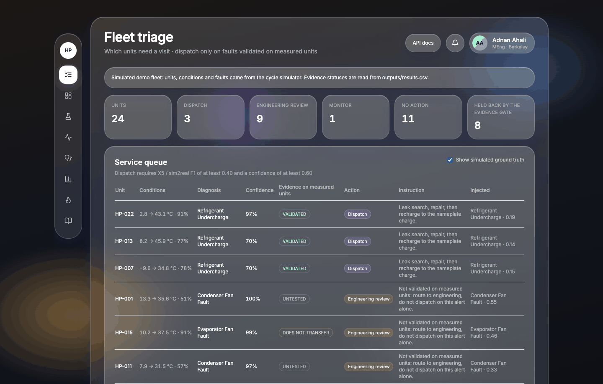

# Case study — from a fault classifier to a service decision

> **Status:** Mixed — the evidence is measured; the user problem is a hypothesis until the interviews in [RESEARCH_KIT.md](RESEARCH_KIT.md) are done.

## The problem

A heat-pump manufacturer can see its connected units, and its installer tools already notify fault codes ([MARKET.md](MARKET.md)). The faults that hurt efficiency most quietly — a slow refrigerant leak, a fouled exchanger — degrade the cycle before any controller code fires. The after-sales team then learns about them from a complaint, and the installer arrives without knowing what to bring. *(Hypothesis.)*

## The user and the decision

The after-sales service engineer at the OEM. Every morning: which units deserve a visit today, and what should the installer be told? A wasted visit costs a truck roll; a missed leak costs efficiency, a customer and possibly a compressor. The product has to support that decision. A probability per fault class does not.

## What I built

- A physics simulator of the vapor-compression cycle (CoolProp R410A) and a classifier on Li & Braun thermodynamic residuals.
- A validation campaign against 7375 NIST chamber tests, where every number is logged with its protocol in `outputs/results.csv`.
- A FastAPI backend and a React dashboard. The Evidence page shows each result next to its protocol.
- **Fleet triage**, the product feature: a service queue where a diagnosis earns a dispatch only if its fault class is validated on measured units (`api/fleet_policy.py`).

## What the evidence forced

Each of these changed what the product may promise. Full record: [DECISION_LOG.md](DECISION_LOG.md).

- The first headline accuracy was a label leak. X0/leaked-dCOP logged 0.996; the honest hold-out is X0/holdout-test 0.893. I withdrew the vanity number and published both.
- Validation protocol matters more than the model: X0b/random-cv 0.954 against X0b/LOMO 0.333 on raw measurements, same data, same classifier.
- The classifier transfers to measured units for refrigerant charge only. In X5/sim2real, undercharge F1 is 0.445 and overcharge 0.522, while condenser fouling is 0 and the evaporator fan 0.031. So the product dispatches on charge faults and routes the rest to engineering review.
- Calibration is a deployment cost, not an algorithm detail. Fifty healthy tests on the target machine reach X1/LOMO-calibration-n50 0.456, against X0b/LOMO 0.602 with the full reference. That becomes a commissioning requirement in the [PRD](PRD.md).
- Failure prediction is parked. No public dataset follows a heat pump from healthy to a dated failure, so a remaining-useful-life model would be trained on a time axis I would have to invent.

## The product decision

The evidence gate is the feature. A class that does not transfer to measured units never triggers a dispatch, and the queue shows the evidence behind every row. Because the gate reads `outputs/results.csv` at request time, an ML fix logged on `main` — for example a corrected condenser-fouling physics — changes the triage with no product code change. A feature flag switches the gate off, and the API reports how many dispatches it held back.

The queue agent is eager: it proposes a dispatch whenever the diagnosis is confident. The rule refuses that proposal when the class does not transfer on X5/sim2real, and the row shows both the proposal and the refusal. A language model may rephrase the installer sentence. It cannot change the action. With no model configured, the sentence stays the fixed one.

## What I would do differently

Discovery first. Five interviews with OEM service engineers before writing the simulator would have told me which faults they lose money on. I built the most accurate thing I could, and only then asked who would act on it.

## What is next

1. Run the interviews and the usability test in [RESEARCH_KIT.md](RESEARCH_KIT.md), and update the assumptions in [DISCOVERY.md](DISCOVERY.md).
2. A shadow-mode pilot with one OEM service team ([GTM_AND_LAUNCH.md](GTM_AND_LAUNCH.md)): compute alerts, send none, and have installers log the fault they find.
3. On the ML side: fix the condenser-fouling physics (roadmap R5), the only path to dispatching on that fault.
