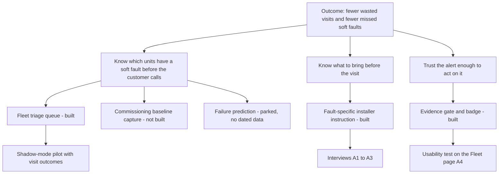

# Discovery — problem, assumptions, opportunities

> **Status:** Hypothesis — written before any interview. Each assumption below says how it will be tested.

## Problem statement

OEM after-sales teams with connected heat pumps learn about soft faults — slow refrigerant loss, fouled exchangers, weak fans — late, usually through a complaint or an efficiency drop. When they do send an installer, the visit often starts with a diagnosis on site, because the remote data says *something is wrong* but not *what*. We believe a service queue that names the fault, and only dispatches on faults it can back with measured evidence, will reduce wasted visits and catch charge loss earlier.

## Who

- **Primary:** the after-sales service engineer at the OEM, who triages the fleet and decides on visits.
- **Secondary:** the installer partner who performs the visit and needs to know what to bring.
- **Out of scope for now:** the homeowner. The homeowner sees the consequence, not the queue.

## Assumptions to test

| ID | Assumption | What exists today | How to test | Status |
|---|---|---|---|---|
| A1 | Soft faults cause a meaningful share of service cost | Nothing measured | Interviews: last ten visits, which were soft faults, cost of each | Untested |
| A2 | Today's OEM tools notify fault codes, not soft faults | Public pages in [MARKET.md](MARKET.md) | Interviews and a hands-on look at one OEM tool | Untested |
| A3 | A wrong dispatch costs more than a late one | Nothing measured | Interviews: cost of a truck roll against cost of a late leak | Untested |
| A4 | Engineers will act on an alert only if they see why it is trusted | The Evidence page exists | Usability test: does the evidence badge change the decision? | Untested |
| A5 | Refrigerant charge is the fault worth starting with | Charge is the only fault that transfers in X5/sim2real (undercharge F1 0.445) | Interviews: is charge loss a top-three service issue? | Supported by measurement, not by users |
| A6 | A healthy reference per unit can be captured at commissioning | Calibration budget measured: X1/LOMO-calibration-n50 reaches 0.456 | Interviews with installers: what is recorded at commissioning today? | Supported by measurement, not by users |
| A7 | Connected units stream enough cycle data (pressures, temperatures, compressor power) | The model needs 23 features (`src/fdd/features.py`) | Ask one OEM for its telemetry point list | Untested |

A1 to A4 decide whether the product is worth building. A5 to A7 decide whether it can work. The project so far has only tested the second group.

## Opportunity solution tree

## What the evidence can tell, and what only users can

The measurements answer *can the system find this fault on a real machine?* They do not answer *does anyone lose money on this fault?* or *would an engineer act on this alert?* Those are the questions in [RESEARCH_KIT.md](RESEARCH_KIT.md).
