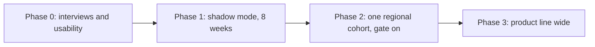

# Go-to-market and launch

> **Status:** Plan — nothing here has happened. It is the plan a pilot would follow, with the criteria to stop.

## Positioning

For OEM after-sales teams with a connected heat-pump fleet, Fleet triage is a service queue that names refrigerant-charge faults before a controller code fires, and dispatches only on faults it can back with measured evidence. Unlike fault-code notifications, it watches the thermodynamic cycle against a healthy reference; unlike building FDD platforms, it is built for the refrigerant side of a heat-pump fleet.

## Ideal first customer

- A heat-pump OEM with connected units already streaming cycle data (assumption A7).
- An after-sales team that dispatches installer partners and pays for wasted visits.
- One product line with commissioning data, or a test-lab baseline, to build the healthy reference.

## Channel

A direct pilot with one OEM service team. Later, a module that feeds the OEM's existing installer tool rather than a new app ([MARKET.md](MARKET.md)).

## Pricing hypothesis

Per connected unit per year, paid by the OEM. No figure is proposed: the interviews ask what a wasted visit and a late leak cost, and the price has to sit well below the visits it saves.

## Launch plan

| Phase | What happens | Exit criterion |
|---|---|---|
| 0. Discovery | Five interviews, three usability sessions ([RESEARCH_KIT.md](RESEARCH_KIT.md)) | A1 to A4 supported, or the plan changes |
| 1. Shadow mode | Alerts computed with the gate on and off, none sent. Installers log the fault found on every visit | Dispatch precision of gated alerts measured against the team's baseline; confidence threshold tuned |
| 2. Cohort | One region receives gated dispatches; the rest stays on today's process as control | Gated region beats control on dispatch precision without more missed charge faults |
| 3. Expansion | All units of the product line | Same KPIs hold at scale; review backlog age stays inside its guardrail |

## Rollout controls

- `FDD_FLEET_VALIDATED_ONLY` keeps the gate on in every phase after shadow mode, and is the comparison inside shadow mode.
- Cohorts by region, so a control group exists.
- Kill switch: stop sending dispatches and fall back to fault codes only, without removing the queue.

## Readiness checklist

- [ ] Installer instruction cards for each dispatchable fault, reviewed by a senior installer
- [ ] Escalation path for engineering-review rows, with an owner
- [ ] Support article: what an evidence badge means, what to do with a review row
- [ ] Sales and partner one-pager: what the queue does, what it does not do
- [ ] Visit-outcome logging in the installer workflow (the north-star input)

## Review cadence

Weekly during shadow mode and the cohort: the KPIs in [STRATEGY.md](STRATEGY.md), the review backlog, and every gate override.

## Iterate, pivot or archive

| If | Then |
|---|---|
| Dispatch precision beats the baseline and missed faults do not rise | Iterate: next fault class (roadmap R5), then commissioning capture |
| Engineers override the gate often | Iterate on trust: what does the badge fail to say? Re-run usability |
| The OEM's units do not stream cycle data | Pivot: an installer-side tool fed by a commissioning and service-visit measurement |
| Interviews show soft faults are not a cost the team tracks | Archive the triage queue; keep the evidence method as a validation service |
