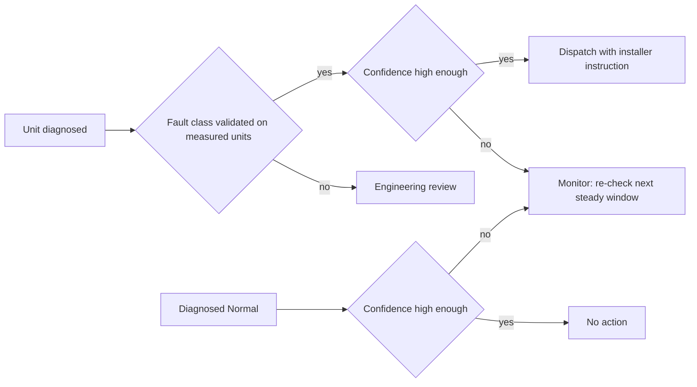

# PRD — Fleet triage, gated on measured evidence

> **Status:** Mixed — the feature, the policy and the tests are built (Measured). The user problem and the analytics are not validated (Hypothesis). Owner: Adnan Ahali. Last updated 2026-10-06.

## Summary

A service queue for an OEM after-sales team. Each connected unit is diagnosed, and the queue says what to do: dispatch, engineering review, monitor, or nothing. A dispatch is only recommended for fault classes the classifier still finds on measured units. Built as `GET /api/fleet` and the Fleet triage page.

## Problem

See [DISCOVERY.md](DISCOVERY.md). In one line: the team finds soft faults late and sends installers without knowing what they will find.

## Users

- **Service engineer at the OEM** — triages the queue every morning and decides on visits.
- **Installer partner** — reads the instruction attached to a dispatch.

## Goals

1. Turn a diagnosis into one action per unit, sorted by urgency.
2. Never recommend a dispatch on a fault class the evidence does not support.
3. Show, on every row, why the system can or cannot be trusted for that fault.

## Non-goals

- Predicting when a unit will fail (parked, see [DECISION_LOG.md](DECISION_LOG.md)).
- Scheduling visits or talking to the homeowner.
- Diagnosing faults the simulator does not model (liquid-line restriction, valve leak).

## User flow

The Fleet triage page is the shipped prototype of this flow: summary counts, a queue sorted by action, an evidence badge whose tooltip names the experiment, protocol and F1, and the installer instruction.

## Requirements

| ID | Requirement | Where |
|---|---|---|
| FR-1 | Each unit gets exactly one action: dispatch, engineering review, monitor, no action | `api/fleet_policy.py` |
| FR-2 | A fault class earns a dispatch only if its evidence status is *transfers* | `api/fleet_policy.py` |
| FR-3 | Evidence is read from `outputs/results.csv` at request time, not copied into code | `api/routers/fleet.py` |
| FR-4 | A class with no logged row is *untested* and never dispatched | `api/fleet_policy.py` |
| FR-5 | Low confidence leads to monitor, including for a unit diagnosed Normal | `api/fleet_policy.py` |
| FR-6 | The queue is sorted dispatch, review, monitor, no action, then by confidence | `api/routers/fleet.py` |
| FR-7 | Every dispatch carries a fault-specific installer instruction | `api/fleet_policy.py` |
| FR-8 | The response says the fleet is simulated and exposes the injected fault as demo-only ground truth | `api/schemas/fleet.py` |
| FR-9 | A flag switches the gate off, and the response counts the dispatches the gate held back | `api/settings.py` |
| FR-10 | No result figure is hardcoded in the interface | `tests/test_docs.py` |

Acceptance criteria for each requirement: [USER_STORIES.md](USER_STORIES.md).

## Evidence policy

Two thresholds, both product decisions, both constants in `api/fleet_policy.py`:

- **Evidence threshold: F1 of at least 0.40 on X5/sim2real.** The question is whether a classifier trained on the simulator still finds the fault on measured NIST units. In X5/sim2real the classes split cleanly: Normal 0.716, overcharge 0.522, undercharge 0.445 on one side; evaporator fan 0.031 and condenser fouling 0 on the other. Any threshold in that gap gives the same decision today. 0.40 is set just under the weakest class that transfers (fleet_policy).
- **Confidence threshold: 0.60 on the predicted class (fleet_policy).** Not measured on users. It is the first thing the shadow-mode pilot tunes, by comparing visit outcomes above and below it.

Classes the simulator models but X5 never measured (evaporator fouling, condenser fan) are *untested*: not dispatched, routed to review.

## Feature flag

`FDD_FLEET_VALIDATED_ONLY` (default on). Off, every confident fault dispatches, as a naive classifier would. The response then reports zero held back, and with the gate on it reports how many dispatches the gate removed. The flag is the rollout control in [GTM_AND_LAUNCH.md](GTM_AND_LAUNCH.md): shadow mode compares both, cohorts run with the gate on.

## Analytics events (to instrument in the pilot)

| Event | Properties | Answers |
|---|---|---|
| `queue_viewed` | engineer, units, counts per action | Is the queue used every day? |
| `dispatch_sent` | unit, fault, confidence, evidence status | Volume and mix of dispatches |
| `review_resolved` | unit, fault, decision, days in review | Is review a decision or a bin? |
| `visit_outcome_logged` | unit, predicted fault, fault found, parts used | Dispatch precision, the north star |
| `gate_overridden` | unit, fault, engineer | Do engineers distrust the gate? |

## Feasibility and constraints

Measured, and they shape the product:

- **The model is trained on simulated cycles.** Tested on measured units it reaches X5/sim2real 0.454 accuracy overall. That is why the gate exists: the product cannot promise every class.
- **Calibration is a commissioning cost.** With a healthy reference from the target machine, residuals reach X0b/LOMO 0.602; from another machine, X1/LOMO 0.318; fifty healthy tests recover to X1/LOMO-calibration-n50 0.456. A product requirement follows: capture a healthy baseline across the operating range at commissioning.
- **The model needs cycle telemetry**: pressures, refrigerant temperatures, compressor power, the 23 features of `src/fdd/features.py`. Whether an OEM's connected units stream them is assumption A7.
- **Hypothesis to test:** an OEM can build the healthy reference per product line from its own test lab, which sits between the transferred and the target-machine reference. Not measured.

Technical shape: a router reads the diagnosed fleet, a pure policy module applies the evidence, the page renders the response. The demo fleet is a seeded simulation, so the same seed gives the same queue.

## Risks

| Risk | Mitigation |
|---|---|
| The gate hides a real fault (a fouled condenser goes to review, not to a visit) | Review queue with an age guardrail; the missed-faults counter-metric |
| Engineers ignore review rows | `review_resolved` and `gate_overridden` events; usability task T5 |
| Simulator-trained confidence is not calibrated on real units | Tune the confidence threshold in shadow mode before any cohort |
| No cycle telemetry on the OEM's units | Ask for the point list before the pilot (A7) |

## Open questions

1. Should engineering review route to the OEM's engineering team or back to the installer with a generic check?
2. Is a unit-level healthy baseline realistic at commissioning, or only a product-line baseline?
3. Who owns the alert inside the OEM: after-sales, connectivity, or quality?
